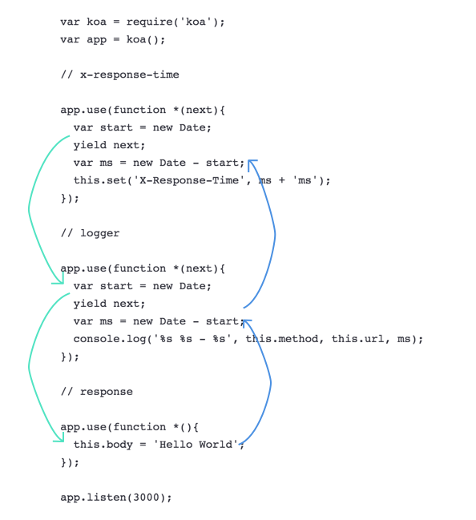

## learn koa2--middleware

玩过express，但没接触过Koa1。虽然Koa2发布到现在，已有的文档资料相比于1而言还缺少许多，但鉴于Koa2对ES6的良好支持和新特性，还是直接干脆的上Koa2比较好吧？因此，下文全部都是基于Koa2学习整理而成的。

Koa真的是一个非常简洁的框架，只是给开发者提供了一个基本的解决方案。之后无论是Router还是Controller或者Model都需要自己去实现，这也就有了很大的扩展空间。

### Install & Basical

新建项目，初始化npm，然后准备koa的安装和初始化：

```bash
$ npm install koa@next --save
# 运行koa
$ npm install nodemon --save
```

为了能够顺畅的使用我们心爱的ES6语法，需要安装一下polyfill

```bash
$ npm install babel-register babel-plugin-transform-async-to-generator --save
$ npm install babel-polyfill --save-dev
$ npm install babel-preset-es2015 --save-dev
$ npm install babel-preset-stage-0 --save-dev
```

顺便在根目录建立`.babelrc`文件：

```
{
  "presets": [
    "es2015",
    "stage-0"
  ]
}
```

建立初始化文件：

```javascript
// app/app.js
import Koa from 'koa';
const app = new Koa();

app.use((ctx, next) => {
  const start = new Date;
  console.log('app 1')
  return next().then(() => {
    const ms = new Date - start;
    console.log('app 1 callback')
    console.log(`${ctx.method} ${ctx.url} - ${ms}ms`);
  });
});

app.use(async (ctx, next) => {
  const start = new Date;
  console.log('app 2')
  await next();
  const ms = new Date - start;
  console.log('app 2 callback')
  console.log(`${ctx.method} ${ctx.url} - ${ms}ms`);
});

app.use(ctx => {
  console.log('app 3')
  ctx.body = "Hello Koa";
});

app.listen(7000);

export default app;
```

```javascript
// index.js
require("babel-core/register");
require("babel-polyfill");
require("./app/app.js");
```

```json
"scripts": {
    "start": "./node_modules/.bin/nodemon index.js"
}
```

之后运行：

```bash
$ npm start
```

打开`localhost:7000`，就能看见Hello Koa喽

### Middleware

middleware（中间件）始终是Koa中的一个核心概念。在middleware中，中间件由外而内的相互嵌套，执行完毕之后再由内到外的依次执行回调。不得不盗张官方的图：


在Koa1中，中间件的表现形式是这样的：

```javascript
var koa = require('koa');
var app = koa();

// x-response-time
app.use(function *(next){
  var start = new Date;
  yield next;
  var ms = new Date - start;
  this.set('X-Response-Time', ms + 'ms');
});

// logger
app.use(function *(next){
  var start = new Date;
  yield next;
  var ms = new Date - start;
  console.log('%s %s - %s', this.method, this.url, ms);
});

// response
app.use(function *(){
  this.body = 'Hello World';
});

app.listen(3000);
```

三个作用的function：`x-response-time`，`logger`，`response`，每个function都是中间件，它们在运行到`yield next`时，会跳到下一个中间件里运行，直到最后一个没有`yield next`的中间件（`response`），在那里执行完毕之后，再从下往上的返回各个中间件，并执行`yield next`之后的语句，用我的渣配图来表示的话就是这样的：



因此，middleware的顺序很重要。

在Koa2中，我们可以使用`async/await`语法，所以中间件可以写成这样：

```javascript
app.use((ctx, next) => {
  const start = new Date;
  console.log('app 1')
  return next().then(() => {
    const ms = new Date - start;
    console.log('app 1 callback')
    console.log(`${ctx.method} ${ctx.url} - ${ms}ms`);
  });
});

app.use(async (ctx, next) => {
  const start = new Date;
  console.log('app 2')
  await next();
  const ms = new Date - start;
  console.log('app 2 callback')
  console.log(`${ctx.method} ${ctx.url} - ${ms}ms`);
});

app.use(ctx => {
  console.log('app 3')
  ctx.body = "hello KOA";
});
```

每一个中间件在`await next()`之前会进入下一个中间件，全部执行完毕之后又会向上执行回调。运行项目，可以打印出log如下：

```bash
app 1
app 2
app 3
app 2 callback
GET / - 3ms
app 1 callback
GET / - 7ms
```

### Middleware best practices

- 对于一个公共的`middleware`，将它用方法包裹起来，并在方法中进行类型检查

例如，一个打印log的`middleware`：

```javascript
const logger = (format) => {
  format = format || ':method ":url"';

  return async (ctx, next) => {
    const str = format
      .replace(':method', ctx.method)
      .replace(':url', ctx.url);

    console.log(str);

    await next();
  };
};

app.use(logger());
app.use(logger(':method :url'));
```

- 命名一个`middleware`，有利于debug

```javascript
const logger = (format) => {
  return async logger(ctx, next) => {
    // print log
  };
};
```

- 将多个`m`通过[`koa-compose`](https://github.com/koajs/compose)组合在一起

```bash
$ npm install koa-compose --save
```

Usage:

```javascript
compose([a, b, c, ...]);
```
