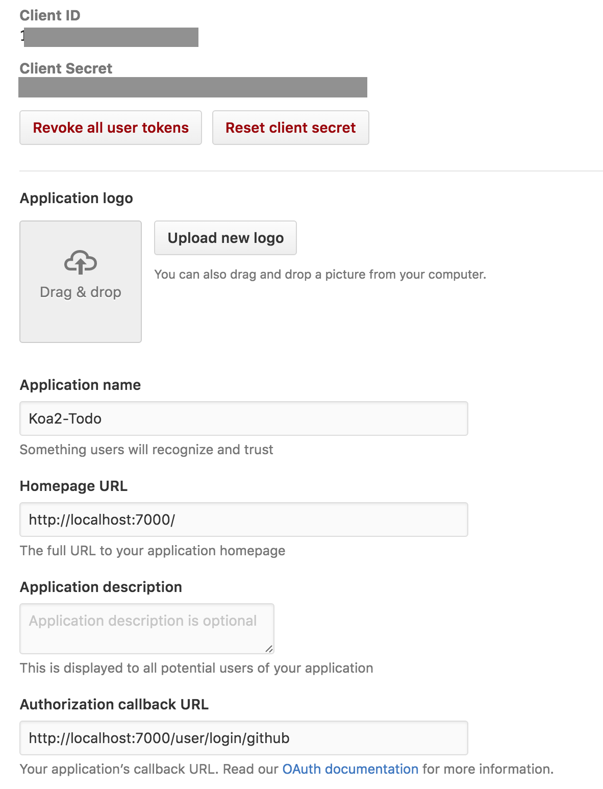

<!-- START doctoc generated TOC please keep comment here to allow auto update -->
<!-- DON'T EDIT THIS SECTION, INSTEAD RE-RUN doctoc TO UPDATE -->
**Table of Contents**  *generated with [DocToc](https://github.com/thlorenz/doctoc)*

- [learn koa2--认证](#learn-koa2--%E8%AE%A4%E8%AF%81)
  - [session](#session)
    - [`session`](#session)
    - [`generic-session`](#generic-session)
    - [`session`加密](#session%E5%8A%A0%E5%AF%86)
    - [use session](#use-session)
  - [csrf](#csrf)
  - [附加--使用github作为第三方登录](#%E9%99%84%E5%8A%A0--%E4%BD%BF%E7%94%A8github%E4%BD%9C%E4%B8%BA%E7%AC%AC%E4%B8%89%E6%96%B9%E7%99%BB%E5%BD%95)
    - [准备](#%E5%87%86%E5%A4%87)
    - [实战](#%E5%AE%9E%E6%88%98)

<!-- END doctoc generated TOC please keep comment here to allow auto update -->

## learn koa2--认证

> 本章涉及session，csrf

### session

#### `session`

- [`koa-session`](https://github.com/koajs/session)

> 基于cookie的session中间件

```bash
$ npm install koa-session
```

`koa-session`本身是基于`koa1`的中间件，因此我们还需要`koa-convert`

```bash
$ npm install koa-convert --save
```

```javascript
import Koa from 'koa';
import convert from 'koa-convert';
import session from 'koa-session';

const app = new Koa();
app.keys = ['keys'];

// session
app.use(session(app));
```

#### `generic-session`

> 使用内存进行session的储存

我们使用`mongo`作为session的储存。需要安装一下两者：

- [`koa-generic-session`](https://github.com/koajs/generic-session)
- [`koa-generic-session-mongo`](https://github.com/pavelvlasov/koa-generic-session-mongo)

```bash
$ npm install koa-generic-session koa-generic-session-mongo --save
```

同样，`koa-generic-session`本身是基于`koa1`的中间件，需要`koa-convert`

```bash
$ npm install koa-convert --save
```

```javascript
import Koa from 'koa';
import convert from 'koa-convert';
import session from 'koa-generic-session';
import MongoStore from 'koa-generic-session-mongo';

const app = new Koa();
app.keys = ['keys'];

// session
app.use(convert(session({
  store: new MongoStore()
})));
```

#### `session`加密

注意到上面两种session在初始化的时候，都有`app.keys = ['keys'];`这句话吗？因为两者session在默认情况下都进行了加密配置（`signed`），必须用`app.keys`指定加密短语。

实际上在使用过程中，往往在生产环节下赋予`app.keys`一个独特的加密配置，对外不可见。

#### use session

举个栗子

```javascript
// ...
app.use((ctx, next) => {
  let n = ctx.session.num || 0;
  console.log(n);
  ctx.session.num = n + 1;
});
```

### csrf

> 基本上是必装插件，防止跨域挟持

- [`koa-csrf`](https://github.com/koajs/csrf)

```bash
# for koa2
$ npm install --save koa-csrf@3.x
# csrf基于session，所以如果没有安装session则需要按照上文安装session
```

```javascript
import Koa from 'koa';
import csrf from 'koa-csrf';
import session from 'koa-session';
import convert from 'koa-convert';

const app = new Koa();
// 加密
app.keys = ['keys'];

// session
app.use(session(app));
// csrf
// 必须放在session后面
app.use(new csrf());

// usage
app.use(async (ctx, next) => {
  await ctx.render('home/index', {
    title: 'home page',
    content: 'this is home page',
    csrf: ctx.csrf
  });
});
```

在模板中：

```html
<form action="/register" method="POST">
  <input type="hidden" name="_csrf" value="<%= csrf %>" />
  <input type="email" name="email" placeholder="Email" />
  <input type="password" name="password" placeholder="Password" />
  <button type="submit">Register</button>
</form>
```

### 附加--使用github作为第三方登录

使用github官方提供的`OAuth2`认证，可以快速的实现基于github的第三方登录

#### 准备

首先要[注册一个自己的应用](https://github.com/settings/applications/new)：

- `Homepage URL`：应用主页，本地测试时可填`localhost:XXXX`
- `Authorization callback URL`：用户同意github授权之后的回调URL，会在这里通过`request body`拿到github提供的`code`，作为获取用户`token`的条件之一

我们创建完成之后，如下图所示：



因此之后必然会创建一个`/user/login/github/`的路由来处理回调。整个流程大致这样：

1. 用户要通过github进行第三方认证，点击链接跳转到`https://github.com/login/oauth/authorize?scope=XXX%20YYY&client_id=XXXXX`页面，其中，`scope`代表我们[要获取的权限](https://developer.github.com/v3/oauth/#scopes)，`client_id`则是刚刚新建应用的id
2. 在用户同意认证之后，跳转到回调页面，但`request`带有参数`?code=XXXXX`，我们需要拿到这个`code`
3. 在服务端向`https://github.com/login/oauth/access_token`发出`POST`请求，并带上`client_id`，`client_secred`，`code`三个参数，从返回值中获取`access_token`
4. 在服务端发出`GET`请求，通过`https://api.github.com/user?access_token=XXX`请求，获取用户的个人公开信息（会根据第一步的`scope`有所不同），并将所需信息和`access_token`储存在`session`里

可以参考的官方资料：

- [注册新应用](https://github.com/settings/applications/new)
- [注册一个个人使用的`access_token`](https://github.com/settings/tokens/new)
- `github OAuth2`
  - [关于`oauth`](https://developer.github.com/guides/getting-started/#oauth)
  - [流程梳理](https://developer.github.com/v3/oauth/#web-application-flow)
  - [用户权限列表](https://developer.github.com/v3/oauth/#scopes)
  - [常见错误](https://developer.github.com/v3/oauth/#common-errors-for-the-authorization-request)
- [需要使用`user-agent`](https://developer.github.com/v3/#user-agent-required)
- [一些第三方封装的`github api`请求库](https://developer.github.com/libraries)

#### 实战

首先新建一个用户界面的view，在没有授权的情况下，展现github授权链接，否则显示退出登录链接：

```html
<!-- app/templates/user/index.html -->



  <h1>{{ content }}</h1>
  
    <span>welcome, {{ user }}</span>
    <br/>
    <br/>
    <a href="/user/logout">logout</a>
  
    <a href="https://github.com/login/oauth/authorize?scope=user:email&client_id=1b1d94a101d42c0f6dee">login with github</a>
  

```

可以看见，我们在链接中放入了`client_id`，并申请获取用户的email。在用户同意授权之后，会跳转到回调链接`http://localhost:7000/user/login/github`，因此需要单独处理它的`route`和`controller`：

```javascript
// app/routes/user.js
import koaRouter from 'koa-router';
import user from '../controllers/user';

const router = koaRouter({
  prefix: '/user'
});
router.get('/', user.userIndex);
router.get('/login/github', checkIfNotLogin, user.github);
router.get('/logout', user.logout);
```

```javascript
// app/controllers/user.js
import {
  // 将获取token和github user信息的逻辑单独封装了起来
  getGithubToke,
  getGithubUser
} from '../services/github';

const userIndex = async (ctx, next) => {
  await ctx.render('user/index', {
    title: 'user home page',
    content: 'this is user home page',
    // user用来判断当前是否授权并登录，以此展现不同view
    user: (ctx.session.user && ctx.session.user.name) || null
  });
};

// 处理 /user/login/github
const github = async (ctx, next) => {
  // 获取code，并由code获取token
  const code = ctx.request.query.code;
  const result = await getGithubToke(code);
  try {
    const token = result.match(/^access_token=(\w+)&/)[1];
    ctx.session.token = token;
    // 并通过token获取用户信息
    // 最终user信息和token都存到了session里
    const userInfo = await getGithubUser(token);
    if (userInfo) {
      ctx.session.user = JSON.parse(userInfo);
      return ctx.redirect('/todo');
    }
    return ctx.redirect('/user');
  } catch (TypeError) {
    return ctx.redirect('/user');
  }
};

const logout = async (ctx, next) => {
  // 退出登录其实就清空了当时的session
  ctx.session.token = null;
  ctx.session.user = null;
  ctx.redirect('/user');
};

export default {
  userIndex,
  github,
  logout
};
```

在拿到`token`之后，获取用户信息并储存起来。

想服务端向github发出请求：（使用[`request`](https://github.com/request/request)）：

```bash
$ npm install --save request
```

```javascript
// app/servers/github.js
import githubConfig from XXX
import request from 'request';

export const getGithubToke = (code) => {
  return new Promise((resolve, reject) => {
    request.post(`https://github.com/login/oauth/access_token?client_id=${githubConfig.clientId}&client_secret=${githubConfig.clientSecret}&code=${code}`, (err, httpResponse, body) => {
      if (httpResponse.statusCode === 200 && body) {
        resolve(body);
      } else {
        reject(false);
      }
    });
  });
};

export const getGithubUser = (token) => {
  return new Promise((resolve, reject) => {
    request.get(`https://api.github.com/user?access_token=${token}`, {
      headers: {
        'User-Agent': githubConfig.appName
      }
    }, (err, httpResponse, body) => {
      if (httpResponse.statusCode === 200 && body) {
        resolve(body);
      } else {
        reject(false);
      }
    });
  });
};
```
