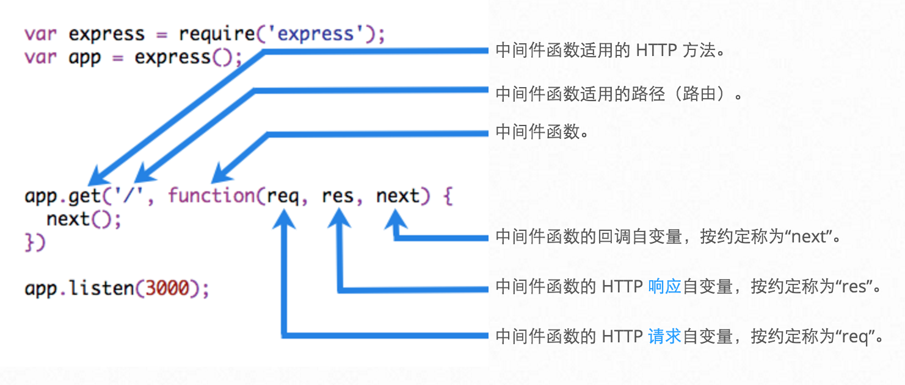

## Express初步 - 中间件

> 中间件函数能够访问请求对象 (req)、响应对象 (res) 以及应用程序的请求/响应循环中的下一个中间件函数。下一个中间件函数通常由名为 next 的变量来表示



要装入中间件函数，需调用 app.use() 并指定中间件函数。

以下代码在根路径 (/) 的路由之前装入 myLogger 中间件函数。应用程序每次收到请求时，会在终端上显示消息“LOGGED”：

```js
var express = require('express');
var app = express();

var myLogger = function (req, res, next) {
  console.log('LOGGED');
  next();
};

app.use(myLogger);

app.get('/', function (req, res) {
  res.send('Hello World!');
});

app.listen(3000);
```

中间件装入顺序很重要：首先装入的中间件函数也首先被执行。

如果在根路径的路由之后装入 myLogger，那么请求永远都不会到达该函数，应用程序也不会显示“LOGGED”，因为根路径的路由处理程序终止了请求/响应循环