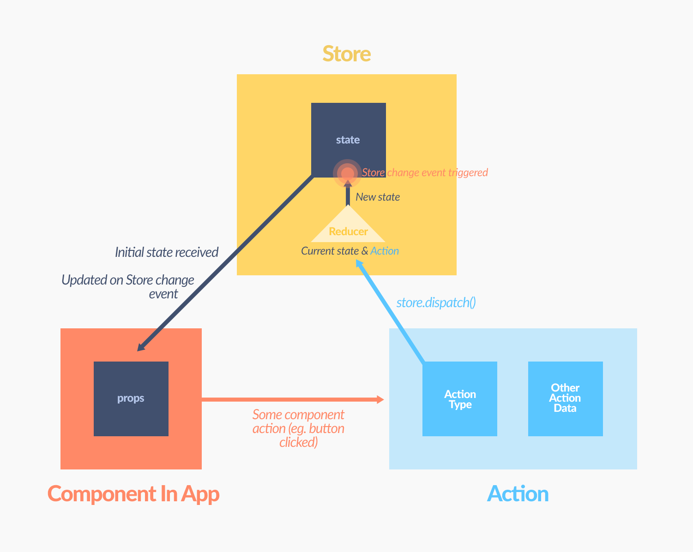

## ReactNative入坑笔记-ThinkInReactNative

部分参考并整理自[构建 F8 2016 App](http://f8-app.liaohuqiu.net/)

> Learn once, write anywhere.

### INTRO

Learn once, write anywhere. 并不是指字面意义的“四处编码运行”，毕竟，从ReactWeb到ReactNative，他们之间的差别还是很大的。但是，因为都是原生的js语言，所以会有很多相同的地方。掌握本质思想，再四处踩踩坑，才能玩的更愉快:)

React系列充满了组件化思想，提倡组件复用。而从中衍生出的flux到Redux，更是利用函数式编程，逐步将代表UI的Component层与逻辑层(reducer, action)分离，从此写前端也有了前后端分离般的快感了呢。

ReactNative和Redux搭配，由此更像是一个大型的单页Web应用，通过内置的`Navigator`进行页面跳转，而Redux则专心负责全局的State和事件处理。UI与逻辑分离，而Native又同时可兼顾iOS与Android双平台，因此需要从ReactNative中公共的UI组件入手，针对不同平台的UI特点进行多平台的适配。

### 组件UI

#### 布局初步

ReactNative的CSS与Web端的CSS有通用但也有很多不同，可以参考这篇文章入门学习：
[react-native 之布局篇](https://segmentfault.com/a/1190000002658374)

#### StyleSheet

通过`Platform`，我们可以分辨应用的运行平台：

```javascript
Platform.OS === 'ios'
```

通过扩展`StyleSheet`，我们可以利用class名称，加载不同的style

```javascript
// from F8 2016 app
// F8StyleSheet.js
import {StyleSheet, Platform} from 'react-native';

export function create(styles: Object): {[name: string]: number} {
  const platformStyles = {};
  Object.keys(styles).forEach((name) => {
    let {ios, android, ...style} = {...styles[name]};
    if(ios && Platform.OS === 'ios') {
      style = {...style, ...ios};
    }
    if(android && Platform.OS === 'android') {
      style = {...style, ...android};
    }
    platformStyles[name] = style;
  });
  return StyleSheet.create(platformStyles);
}

// usage, from F8 2016 app
// F8SegmentedControl.js
import F8StyleSheet from './F8StyleSheet';

const styles = F8StyleSheet.create({
  container: {
    flexDirection: 'row',
    backgroundColor: 'transparent',
    ios: {
      paddingBottom: 6,
      justifyContent: 'center',
      alignItems: 'center',
    },
    android: {
      paddingLeft: 60,
    },
  }
});
```

#### 按文件名加载

有时候，不同的平台有自己独特的插件，如`NavigatorIOS`,`DrawerLayoutAndroid`。这种时候我们就不得不把组件文件分离。

```javascript
// file name
AppContainer.android.js
AppContainer.ios.js

// usage
import AppContainer from './AppContainer';
```

### 数据

#### Redux



戳这里看[Redux的入坑笔记](../Redux/Redux入坑笔记-ThinkInRedux.md)和[详细解析](../Redux/Redux入坑笔记-源码解析)

#### 数据储存`AsyncStorage`

`AsyncStorage`是ReactNative中内置的**异步**储存系统。

它的方法返回一个`Promise`对象

  - `getItem(key: string, callback(err, result))`
  - `setItem(ket: string, value: string, callback(err))`

  - `multiMerge([[key1,val1],[key2,val2]..], callback(err))`
  - `mergeItem(key: string, value: string, callback(err))`

```javascript
let UID123_object = {
 name: 'Chris',
 age: 30,
 traits: {hair: 'brown', eyes: 'brown'},
};

// need only define what will be added or updated
let UID123_delta = {
 age: 31,
 traits: {eyes: 'blue', shoe_size: 10}
};

AsyncStorage.setItem('UID123', JSON.stringify(UID123_object), () => {
  AsyncStorage.mergeItem('UID123', JSON.stringify(UID123_delta), () => {
    AsyncStorage.getItem('UID123', (err, result) => {
      console.log(result);
      // => {'name':'Chris','age':31,'traits':{'shoe_size':10,'hair':'brown','eyes':'blue'}}
    });
  });
});
```

  - `clear(callback(err))` // clear all AsyncStorage
  - `getAllKeys(callback(err, keys))`


  - `multiGet(keys[key1, key2..], callback(err, result[[key1, val1], [[key2, val2]]]))`

```javascript
AsyncStorage.getAllKeys((err, keys) => {
  AsyncStorage.multiGet(keys, (err, stores) => {
    // stores => [[key1, val1], [key2, val2]...]
   stores.map((result, i, store) => {
     // get at each store's key/value so you can work with it
     let key = store[i][0];
     let value = store[i][1];
    });
  });
});
```

  - `multiSet(KeyValuePairs[[key1,val1],[key2,val2]..], callback(err))`
  - `multiRemove(keys[key1, key2..], callback(err))`

```javascript
let keys = ['k1', 'k2'];
AsyncStorage.multiRemove(keys, (err) => {
  // keys k1 & k2 removed, if they existed
  // do most stuff after removal (if you want)
});
```

可以使用ES7的`async/await`同步式的使用`AsyncStorage`

```javascript
async getUserToken(name) {
  try {
    let token = await AsyncStorage.getItem(name);
    // do something
    return result;
  } catch(error) {
    // do something
    return result;
  }
}

checkIfLogin() {
  let result = this.getUserToken().done();
}
```

#### 使用`redux-persist`完成数据持久化

使用[redux-persist](https://github.com/rt2zz/redux-persist)可以配合Redux完成数据持久化储存，使应用在断网的时候可以使用

```javascript
$ npm i --save redux-persist
```

还记得React中`createStore`的使用吗

```javascript
const store = createStore(reducer, initState, enhancer);
// => 在使用applyMiddleware等enhancer时，其本质等价于
const store = enhancer(createStore)(reducer, initState);
```

`redux-persist`也是一个enhancer

```javascript
// basic usage
import {persistStore, autoRehydrate} from 'redux-persist'
const store = createStore(reducer, iniState, autoRehydrate());
persistStore(store);
```

在和其他enhancer搭配的时候

```javascript
import { AsyncStorage } from 'react-native';
import { createStore, applyMiddleware } from 'redux';
import thunk from 'redux-thunk';
import {persistStore, autoRehydrate} from 'redux-persist';

// 先用applyMiddleware封装createStore，返回新的store
const middlewareWrapper = applyMiddleware(thunk);
const store = middlewareWrapper(createStore);

// autoRehydrate()返回一个可作用于Store的函数
const rehydrator = autoRehydrate();
// 将之前存储于本地的 Store 对象用当前的 Store 的 state 进行自动更新
const AppStore = rehydrator(store)(appReducer, initialState);
// 处理 Store 保存到本地存储相关的逻辑，将持久化数据(store)储存在AsyncStorage中
persistStore(AppStore, {storage: AsyncStorage});
```