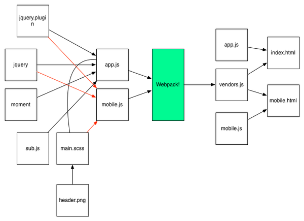
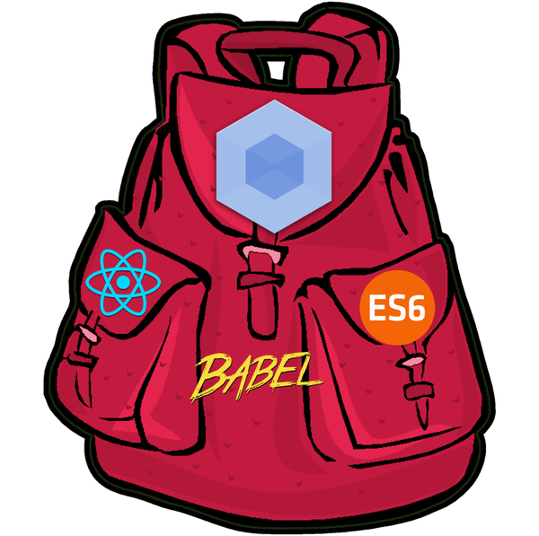

## 在Webpack下实时调试React组件

需要用到两个库
- webpack-dev-server
- react-hot-loader

Installation

```js
$ npm install --save-dev webpack-dev-server react-hot-loader
```

Configuration

```js
module: {
  loaders: [
    {
      test: /\.js?$/,
      loaders: ['react-hot', 'babel'],
      include: [path.join(__dirname, 'scripts')]
    }
  ]
},
//热替换的插件和防止报错的插件
plugins: [
  new webpack.HotModuleReplacementPlugin(),
  new webpack.NoErrorsPlugin()
]
```

启动一个服务器
在本地3000端口起个服务器吧，在项目根目录下面建个server.js

```js
var webpack = require('webpack');
var WebpackDevServer = require('webpack-dev-server');
var config = require('./webpack.config');

new WebpackDevServer(webpack(config), {
  publicPath: config.output.publicPath,
  hot: true,
  historyApiFallback: true
}).listen(3000, 'localhost', function (err, result) {
  if (err) console.log(err);
  console.log('Listening at localhost:3000');
});
```

这样就可以在本地3000端口开启调试服务器了，比如我的页面是根目录下地index.html，就可以直接通过http://localhost:3000/index.html访问页面，修改React组件后页面也会被同步修改

---

## 优化重合并
在开发环境中使用压缩文件

你可能注意到在引入 React JS 到你的项目之后，给你的应用重新合并会花费太多的时间。在开发环境中，最理想的是编译最多 200 到 800 毫秒的速度，取决于你在开发的应用。

为了不让 Webpack 去遍历 React JS 及其依赖，你可以在开发中重写它的行为。

```js
//webpack.config.js
var path = require('path');
var node_modules = path.resolve(__dirname, 'node_modules');
var pathToReact = path.resolve(node_modules, 'react/dist/react.min.js');

config = {
    entry: ['webpack/hot/dev-server', path.resolve(__dirname, 'app/main.js')],
    resolve: {
        alias: {
          'react': pathToReact
        }
    },
    output: {
        path: path.resolve(__dirname, 'build'),
        filename: 'bundle.js',
    },
    module: {
        loaders: [{
            test: /\.jsx?$/,
            loader: 'babel'
        }],
        noParse: [pathToReact]
    }    
};

module.exports = config;
```

我们在配置中做了两件事：
- 不管 “React” 是什么时候在代码中引入的，它会去匹配压缩后的 React JS 文件取代去 node_modules 中遍历。
- 不管 Webpack 什么时候试图是解析压缩文件，我们阻止它，告诉它那不是必须的。

---

## 部署上线

假如项目已经开发完了，需要部署上线了。我们应该新创建一个单独的config文件，因为部署上线使用webpack的时候我们不需要一些dev-tools,dev-server和jshint校验等

复制我们现有的config文件，命名为 webpack.production.config.js，将里面关于 devServer等和开发有关的东西删掉

在package.json中添加一个命令:

```js
"scripts": {
    "start": "webpack-dev-server --hot --inline",
    "build": "webpack --progress --profile --colors --config webpack.production.config.js"
}
```

当要上线的时候,运行:

```js
$ npm run build
```

可以发现build文件夹中生成了所有东西。

---

## 分离js,css和第三方库

现在我们build出来的只有一个bundle.js 如果第三方库很多的话，会造成这个文件非常大，减慢加载速度，现在我们要把第三方库和我们app本身的代码分成两个文件

#### 修改entry入口文件

```js
var path = require('path');
var ROOT_PATH = path.resolve(__dirname);
var APP_PATH = path.resolve(ROOT_PATH, 'app');

...
entry: {
    app: path.resolve(APP_PATH, 'index.js'),
    //添加要打包在vendors里面的库
    vendors: ['jquery', 'moment']
},
```

#### 分离js公共库 与 代码混淆丑化

**添加CommonsChunkPlugin**

```js
$ sudo npm install extract-text-webpack-plugin --save
```

```js
var webpack = require('webpack');

plugins: [
    //这个使用uglifyJs压缩你的js代码
    // new webpack.optimize.UglifyJsPlugin({minimize: true}),
    new webpack.optimize.UglifyJsPlugin({
      //在混淆代码时，以下配置的变量，不会被混淆
      mangle: {
        except: ['$super', '$', 'exports', 'require']
        //以上变量‘$super’, ‘$’, ‘exports’ or ‘require’，不会被混淆
      },
      compress: {
        warnings: false
      }
    }),
    //把入口文件里面的数组打包成verdors.js(公共文件,供浏览器缓存)
    new webpack.optimize.CommonsChunkPlugin({
       // 与 entry 中的 jquery 对应
    	name: 'vendors',
    	// 输出的公共资源名称
    	filename: 'vendors.bundle.js',
       // 对所有entry实行这个规则
       minChunks: Infinity
    }),
    // 生成html
    new HtmlwebpackPlugin({
      title: 'Hello World app'
    })
]
```

添加完毕 运行：

```js
$ npm run build
```

在build文件夹中发现如下结构

```js
budle.js
index.html
vendors.bundle.js
```

#### 剥离css

- Installation

```js
$ npm install extract-text-webpack-plugin -–save-dev //安装插件
```

- Configuration

```js
var ExtractTextPlugin = require("extract-text-webpack-plugin");


loaders: [
        {test: /\.css$/, loader: ExtractTextPlugin.extract("style-loader", "css-loader")},
        //{ test: /\.css$/, loader: "style-loader!css-loader" }
        //使用ExtractTextPlugin的时候不要再用css-loader
],
plugins: [
        new ExtractTextPlugin("[name].css")
        //所有独立样式打包成一个css文件
        //new ExtractTextPlugin("[name].css", {allChunks: true})
]
```

---

## 生成多页面

应用不可能都是SPA，不可能只生成一个html文件，如何生成多个html页面？

假设需求如下：
有两个页面，一个叫index.html，它需要引用vendors.js和app.js这两个文件
还有一个mobile.html页面，他要引用vendors.js和mobile.js这两个文件

在config里面配置：

```js
var path = require('path');
var ROOT_PATH = path.resolve(__dirname);
var APP_PATH = path.resolve(ROOT_PATH, 'app');
var BUILD_PATH = path.resolve(ROOT_PATH, 'build');

...
entry: {
  //三个入口文件，app, mobile和 vendors
  app: path.resolve(APP_PATH, 'index.js'),
  mobile: path.resolve(APP_PATH, 'mobile.js'),
  vendors: ['jquery', 'moment']
},
output: {
  path: BUILD_PATH,
  //注意 我们修改了bundle.js 用一个数组[name]来代替，他会根据entry的入口文件名称生成多个js文件，这里就是(app.js,mobile.js和vendors.js)
  filename: '[name].js'
},
```

---

## 制作模板页面

利用`html-webpack-plugin`
配置过程见Webpack入门

使用过程：

新建一个专门放模版的文件夹templates,在里面加两个模版文件
例如，index.html 和 mobile.html

```html
//index.html
<!DOCTYPE html>
<html>
  <head>
    <title></title>
  </head>
  <body>
    <h3>Welcome to webpack</h3>
  </body>
</html>

//mobile.html
<!DOCTYPE html>
<html>
  <head>
    <title></title>
  </head>
  <body>
    <h3>Welcome to mobile page</h3>
  </body>
</html>
```

继续配置config.js,现在让HtmlwebpackPlugin可以生成多个文件

```js
var path = require('path');
var HtmlwebpackPlugin = require('html-webpack-plugin');
//定义了一些文件夹的路径
var ROOT_PATH = path.resolve(__dirname);
var TEM_PATH = path.resolve(ROOT_PATH, 'templates');

module.exports = {
  entry: {
    //三个入口文件，app, mobile和 vendors
    app: path.resolve(APP_PATH, 'index.js'),
    mobile: path.resolve(APP_PATH, 'mobile.js'),
    vendors: ['jquery', 'moment']
  },
  output: {
    path: BUILD_PATH,
    //注意 我们修改了bundle.js 用一个数组[name]来代替，他会根据entry的入口文件名称生成多个js文件，这里就是(app.js,mobile.js和vendors.js)
    filename: '[name].js'
  },
  ...
  
  plugins: [
  ...
  //创建了两个HtmlWebpackPlugin的实例，生成两个页面
  new HtmlwebpackPlugin({
    title: 'Hello World app',
    template: path.resolve(TEM_PATH, 'index.html'),
    filename: 'index.html',
    //chunks这个参数告诉插件要引用entry里面的哪几个入口
    chunks: ['app', 'vendors'],
    //要把script插入到标签里
    inject: 'body'
  }),
  new HtmlwebpackPlugin({
    title: 'Hello Mobile app',
    template: path.resolve(TEM_PATH, 'mobile.html'),
    filename: 'mobile.html',
    chunks: ['mobile', 'vendors'],
    inject: 'body'
  })
  ...]
  
  ...
}
```

运行：

```js
$ npm run build
```

---

## 生成Hash名称的script来防止缓存

基于文件的md5,通过直接在文件名后面加参数，防止浏览器的缓存

```js
output: {
  path: BUILD_PATH,
  //只要再加上hash这个参数就可以了
  filename: '[name].[hash].js'
},
```

---

## 异步懒加载
在开发webapp时，总会有一些功能是使用过程中才会用到的，出于性能优化的需要，对于这部分资源我们希望做成异步加载，所以这部分的代码一般不用打包到入口文件里边。

对于这一点，webpack提供了非常好的支持，即code splitting，即使用`require.ensure()`作为代码分割的标识。

例如某个需求场景，根据url参数，加载不同的两个UI组件，示例代码如下：

```js
var component = getUrlQuery('component');

if('dialog' === component) {
    require.ensure([], function(require) {
        var dialog = require('./components/dialog');
        // todo ...
    });
}

if('toast' === component) {
    require.ensure([], function(require) {
        var toast = require('./components/toast');
        // todo ...
    });
}
```

webpack会将require.ensure()包裹的部分单独打包

```js
if (window.location.pathname === '/feed') {
  showLoadingState();
  require.ensure([], function() { // this syntax is weird but it works
    hideLoadingState();
    require('./feed').show(); // when this function is called, the module is guaranteed to be synchronously available.
  });
} else if (window.location.pathname === '/profile') {
  showLoadingState();
  require.ensure([], function() {
    hideLoadingState();
    require('./profile').show();
  });
}
```


