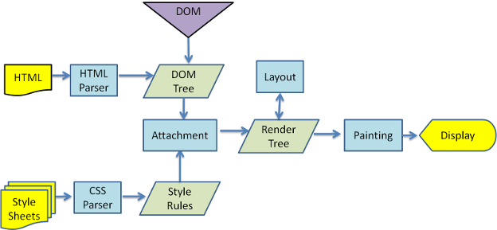

## 网页渲染过程

网页的生成过程，大致可以分成五步：
- HTML代码转化成DOM
- CSS代码转化成CSSOM（CSS Object Model）
- 结合DOM和CSSOM，生成一棵渲染树（包含每个节点的视觉信息）
- 生成布局（layout），即将所有渲染树的所有节点进行平面合成
- 将布局绘制（paint）在屏幕上

前三步很快，后两步"生成布局"（flow）和"绘制"（paint），合称为"渲染"（render），渲染速度较慢



---

## 网页渲染

以下三种情况，会导致网页重新渲染：
- 修改DOM
- 修改样式表
- 用户事件（比如鼠标悬停、页面滚动、输入框键入文字、改变窗口大小等等）

重新渲染，就需要**重新生成布局**和**重新绘制**。
前者叫做"重排"（reflow），后者叫做"重绘"（repaint）

"重绘"不一定需要"重排"，比如改变某个网页元素的颜色，就只会触发"重绘"，不会触发"重排"，因为布局没有改变。
"重排"必然导致"重绘"，比如改变一个网页元素的位置，就会同时触发"重排"和"重绘"，因为布局改变了

---

## 减少网页渲染

提高网页性能，就是要降低"重排"和"重绘"的频率和成本，尽量少触发重新渲染。

要点：
**尽量把所有的变动集中在一起，排成一个队列，然后一次性执行，尽量避免多次重新渲染**

（1）下列代码中，div元素有两个样式变动，但是浏览器只会触发一次重排和重绘

```js
div.style.color = 'blue';
div.style.marginTop = '30px';
```

（2）下面代码对div元素设置背景色以后，第二行要求浏览器给出该元素的位置，所以浏览器不得不立即重排。

```js
div.style.color = 'blue';
var margin = parseInt(div.style.marginTop);
div.style.marginTop = (margin + 10) + 'px';
```

如果有下面这些属性的读操作，都会引发浏览器立即重新渲染：

```js
offsetTop/offsetLeft/offsetWidth/offsetHeight
scrollTop/scrollLeft/scrollWidth/scrollHeight
clientTop/clientLeft/clientWidth/clientHeight
getComputedStyle()
```

**尽量不要把读操作和写操作，放在一个语句里面**

```js
// bad
div.style.left = div.offsetLeft + 10 + "px";
div.style.top = div.offsetTop + 10 + "px";

// good
var left = div.offsetLeft;
var top  = div.offsetTop;
div.style.left = left + 10 + "px";
div.style.top = top + 10 + "px";
```

---

## 提高网页性能的技巧

- 上一节说到的，DOM 的多个读操作（或多个写操作），应该放在一起。不要两个读操作之间，加入一个写操作。
- 如果某个样式是通过重排得到的，那么最好缓存结果。避免下一次用到的时候，浏览器又要重排。
- 不要一条条地改变样式，而要通过改变class，或者csstext属性，一次性地改变样式。
- 尽量使用离线DOM，而不是真实的网面DOM，来改变元素样式。比如，操作Document Fragment对象，完成后再把这个对象加入DOM。再比如，使用 cloneNode() 方法，在克隆的节点上进行操作，然后再用克隆的节点替换原始节点。
- 先将元素设为display: none（需要1次重排和重绘），然后对这个节点进行100次操作，最后再恢复显示（需要1次重排和重绘）。这样一来，你就用两次重新渲染，取代了可能高达100次的重新渲染。
- position属性为absolute或fixed的元素，重排的开销会比较小，因为不用考虑它对其他元素的影响。
- 只在必要的时候，才将元素的display属性为可见，因为不可见的元素不影响重排和重绘。另外，visibility : hidden的元素只对重绘有影响，不影响重排。
- 使用虚拟DOM的脚本库，比如React等。
- 使用 window.requestAnimationFrame()、window.requestIdleCallback() 这两个方法调节重新渲染

---

## 通过降低刷新率提高性能

### `window.requestAnimationFrame()`

下面的代码使用循环操作，将每个元素的高度都增加一倍。可是，每次循环都是，读操作后面跟着一个写操作。这会在短时间内触发大量的重新渲染

```js
function doubleHeight(element) {
  var currentHeight = element.clientHeight;
  element.style.height = (currentHeight * 2) + 'px';
}
elements.forEach(doubleHeight);
```

在滚动监听中使用，将渲染推迟到下一次：

```js
$(window).on('scroll', function() {
   window.requestAnimationFrame(scrollHandler);
});
```

### `window.requestIdleCallback()`

它指定只有当一帧的末尾有空闲时间，才会执行回调函数

```js
requestIdleCallback(fn);
```

它可以接受第二个参数，表示指定的毫秒数。如果在指定 的这段时间之内，每一帧都没有空闲时间，那么函数fn将会强制执行

```js
requestIdleCallback(fn, 5000);
```

摘自：
[阮一峰：网页性能管理详解](http://www.ruanyifeng.com/blog/2015/09/web-page-performance-in-depth.html)


