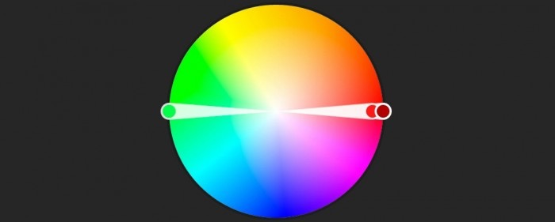
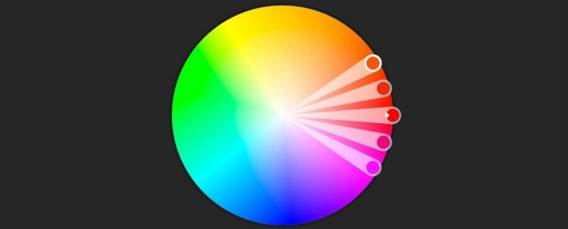
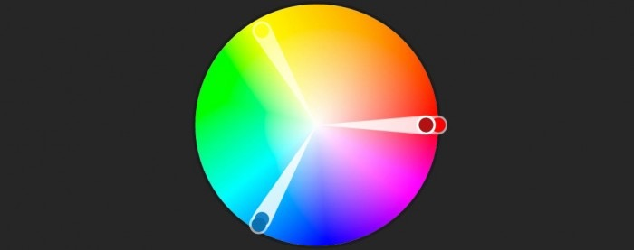
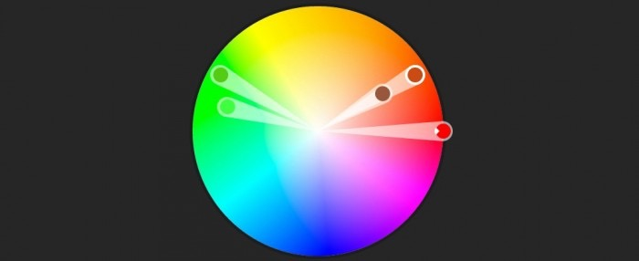
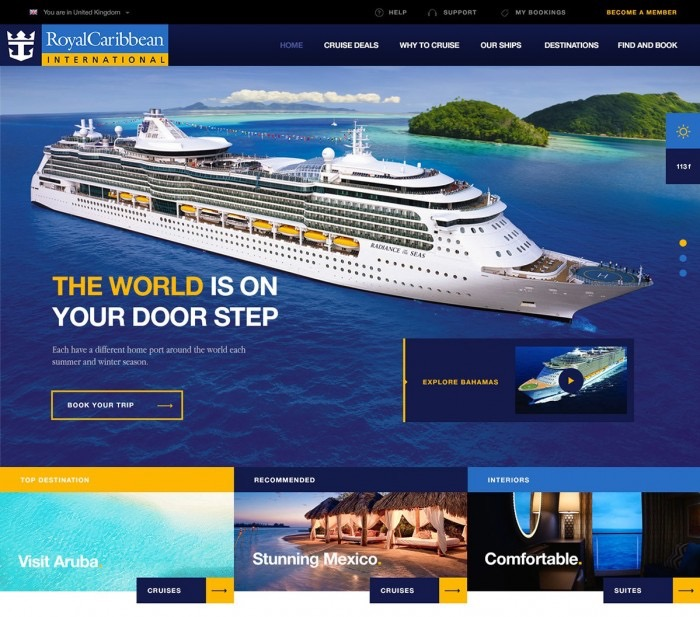
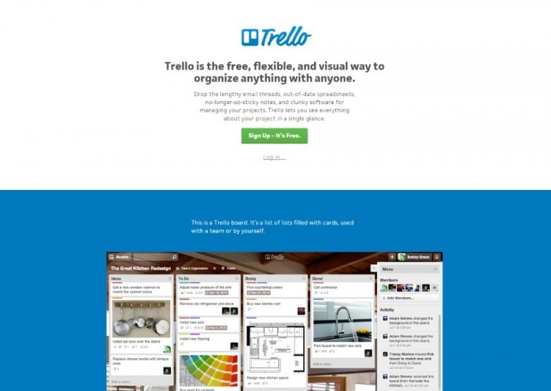

## 网页设计中隐藏在色彩之后的情感和心理学

> 译自 [The Psychology and Emotion Behind Color in Web Design](http://blogs.adobe.com/dreamweaver/2015/10/the-psychology-and-emotion-behind-color-in-web-design.html)

当我在2000年中旬的时候，还是一个非常糟糕的设计师。

讲真，都没法说了。

这并不是说我对于那个工具或者什么鬼的东西手足无措，而问题出在其他地方：

**颜色**

如果用一句话来总结我的缺点，那就是：我并不是为了要达成的目标或者网站所要吸引的用户而使用一些颜色，而是根据自己的个人喜好去用他们。

比如吧，亮绿色简直就是我绳命里的最爱，然后你猜猜发生了什么。。。我早期的设计生涯简直一片绿，就没其他东西了。

“hey我喜欢绿色人人都喜欢绿色，所以网站也得是绿色的！”---这真的不是一个运用颜色的好思路

但后来，我意识到，也许当你对网站进行设计的时候，需要对颜色的选择进行更深入的思考。那并不是一个三秒的头脑风暴就能决定的了的。它不像站点logo配色那样，而是一个更加完整和巨大的问题。更何况，颜色或许还是设计师最有效有力的一个工具

正如科学所证明的那样，颜色会引发特定的感情。你还可以瞅瞅[色彩与感情的关联](http://www.informationisbeautiful.net/visualizations/colours-in-cultures/)。

那么，如何找到一个适合你的(色彩设计)方法呢？如何为了达成一个目标，或是设计一个网站或者面向一些特定的用户群体，而正确的运用色彩呢？来来来让我们试着回答这些问题。

### Step #1.思考你的目标

对颜色的正确选择，要比选一个看起来还凑合的颜色，或者给网站定个品牌什么的要严肃的多。

当你有了一个目标或工作任务的时候，对于颜色的思考就已经开始了。

在大多数情况下，**网站的目标是为了转换--将用户拉的更近，以便提供进一步的服务**

因为，思考你的目标将会是一个好的开始。除此以外，也要思考你的目标所想要带来或引导的用户行为，例如：

  - 用户的行为依赖感情的响应吗
  - 或者用户的行为更易于估量，需要用户处于一个平静的状态中？
  - 这些转变能够带来money吗？在这个情景下（译者注：付钱的情景下），用户是否需要在当时的环境中感觉安全？
  - 用户的行为是意味着获得收益还是减少损失？
  - 当用户访问网站的时候，是否已经有了我们想要（他有）的情感？你是否想让他们继续保持在当前状态下？

当你回答完这些问题的时候，或许能够让你对用户感情状态有一个更好的见解。有了这个认知之后，你就可以使用各种工具来让用户处于正确的情感状态之下，或者至少让他们保持它。

### Step #2.理解你的受众

我们首先要铭记的是：

**色彩并不是普遍受用的**

这意味着，随着你受众的改变，比需要运用不同的颜色唤起不同的感情。颜色与人的关系受到很多因素的影响。地理位置，人文背景，宗教信仰，政治差异，当前发生的大事，这些都在其中扮演了一定的角色。

因此，请记住，弄清你所想要用户达成的感情状态只是问题的一般。另一半则是如何高效的引导用户达到那个状态上去。

最糟糕的方法是，依据自身的文化教育背景，使用自我感觉良好的颜色，而没有针对目标群体进行研究。如果你这么做了，那你成功的概率只能悲剧的依赖于用户群体和你自身重叠的概率了。

举个例子吧，使用绿色作为想要唤起用户行为的按钮的颜色，并不使用于全球范围内的用户。因为在一些南美文化中，绿色与死亡挂钩。

因此，首先请搜索你目标用户的文化背景/地理位置等信息与颜色之间的关联。

使用[信息图表](http://www.informationisbeautiful.net/visualizations/colours-in-cultures/)会是一个好的办法。这上面对于基础颜色和他们对不同文化的关联给出了很好的预览。另外这篇[Color and cultural design considerations](http://www.webdesignerdepot.com/2012/06/color-and-cultural-design-considerations/)也很赞。它对于色彩和文化的重要性进行了更深层次的讨论。

我应该对于我们的目标进行更精细的讨论与思考。此时此刻，你不再仅仅是找一个网站可以适用的颜色，而是依据你想吸引的用户的不同文化教育背景，寻找一套指导方针。基于这点，再去寻找可以唤醒特定情感的色彩。（你的网站目标所需要的用户情感）

### Step #3. 色彩面板以及如何使用

网页设计的一个难点是，你不能只使用一种颜色。有时候你得用一大把。

看看笔记里的上一步--你的指导方针需要设计传达高兴的情感--为此你可以探索色彩面板。这时，我会使用[Adobe’s Color Wheel](https://color.adobe.com/zh/create/color-wheel/)工具，它提供了很赞的UI和通用的色彩模板。例如：

#### 互补色

包含了两个相互对立的颜色。它会依据颜色的对立而形成鲜明的对比。

#### 同色系

同色系的颜色在色彩面板的相同颜色区域内。但它们在亮度方面成对比对立。

#### 三原色

色彩面板中的平衡。通常是最安全最易于使用的

#### 复合色

也叫作拆分互补色，通常由四种颜色组成--两对互补色。它比较难以使用

对于色彩面板如何运用的tip是，不要太陷入颜色选择的决策中。你应该从基础颜色开始--这个基础颜色是色彩面板的核心。之后，基于这个颜色之上开始构建色彩搭配--这时，可以使用Adobe’s Color Wheel

你所运用的核心色彩，应该与你想要唤醒的用户情感紧密关联。它应该成为你的主要工具--工作围绕着这个颜色完成。

之后，其他的颜色用来做一些其他小任务，来通过各种方式增强你的核心目标。

举个栗子（蓝色-主色调，黄色-辅助色）：

### Step #4.养头紫色的奶牛

【别真的跑去养个紫色奶牛啊，哪怕你真的可以】（译者注：是的我们应该去养头绿色的奶牛:)）

紫色奶牛是我读的Seth Godin的书里的一个标题名。

简而言之（译者注：原文为In a nutshell，学到了），这本书讲的是如何通过引人注目来转变你的工作。其中的一个思想是，让你的工作不能被忽视或小瞧，就像头紫色的奶牛。

这个思想转化到设计上则是指，在你的设计中用聪明的方式使用重点色（重点色在Material Design中得到了很好的运用。通过这篇[New to Material Design? 12 Principles You Need to Know](http://blogs.adobe.com/dreamweaver/2015/05/new-to-material-design-12-principles-you-need-to-know.html)来学习）。

使用重点色--铭记它应该与你的主色调相关联--**重点色应该加在想要唤起用户行为的元素上**，通常是一些按钮。通过这样可以使这些元素得到非常好的展现。

举个栗子（注意那个绿色按钮，它是这个页面中唯一的绿色元素）：

> Note: 要确信你使用的重点色与你想要唤起的用户情感/行为想呼应

### Step #5.中立色-居家旅行好帮手

在设计的过程中你不能使用太多的颜色，否则会面临适得其反的危险。

举个栗子，看看下面这个设计：

PayPal对于色彩的运用非常聪明。他们的主色调是蓝色--传达出安全的信息--但是并没有让整个页面都变成蓝色，只是一些特定的元素（包括他们的logo）。因此，没有显得过度设计，不会让人心生疑虑--好像是强烈的想要传达信息的那种过度设计。

PayPal使用了很多中立色：白色和灰色的阴影

中立色作为设计的背景色时可以表现的非常出色。它们可以让你利用更多的情感--重点色往往只会唤醒少部分情感

通常被使用的重点色有--依赖于你想要吸引的用户--白色、黑色、灰色、棕色、淺褐色的米色（原文：beige）、奶油色/象牙色。

将辅助色用在背景上，将会使其他颜色更加夺目，吸引更多的注意力，提高潜在的影响力。

值得一提的是，黑白色的搭配在色彩面板里较为出众。这以为着你可以放心的使用它们，而不必担心搞砸掉。

因此言而言之，别做的太过火。在适当的地方使用你的主色调和辅助色，将会使你的设计更加666

### 你的色彩作弊表

好了，到目前为止我们已经谈论了很多关于色彩库和选择颜色的问题了。那么，我们再来过一遍基础颜色，学习一下它们在西方文化中蕴含的情感作用。

你可以猛戳[Web design color theory: how to create the right emotions with color in web design](http://thenextweb.com/dd/2015/04/07/how-to-create-the-right-emotions-with-color-in-web-design/)和[Psychological Properties Of Colours](http://www.colour-affects.co.uk/psychological-properties-of-colours)查看更完整的实例

#### 黑色

相关联的感情：老练，具有魅力，安全，能力，具有效率。但同时也与压迫、冷漠、笨重有关

#### 白色

卫生，美德，无菌，纯净，干净，简单，有修养。但也有：冷漠，不友好

#### 灰色

中立，正式，忧郁。也有：没有信任，抑郁，没有能量缺乏动力

#### 红色

能量，权利，能力，温暖，有男子汉气概，激动，重要的，年轻。也有：危险，侵犯，具有压力的

#### 蓝色

智力，交流，信任，安全，开放，可靠，高效，逻辑，理性，清爽，平静。也有：冷漠，缺乏感性

#### 黄色

乐观，开心，热情，信任，自尊，感人的，友好，有创造性。也有：恐惧，抑郁，焦虑

#### 绿色

河蟹，平衡，新鲜，休整，成长，牢靠，经济，宽慰，环境，和平。也有：乏味，停滞，衰弱

#### 紫色

精神意识，控制，奢侈，浪漫，神秘，可靠，信任，质量。也有：内心，堕落，自卑

#### 橘黄色

身体舒适，食欲，友好，能量，温暖，安全，激情，富裕，独特唯一。也有：贫困，失望，孩子气

#### 粉色

身心平静，培养，温暖，阴柔，爱，性感。也有：拘谨，情感低落，身体柔弱

#### 棕色

严肃，温暖，可靠，支持，健壮。也有：缺乏人性，笨重，老于世故

### 总结

来让我们总结下网页设计中运用颜色的几个步骤：

  1. 思考目标。明确你所希望的用户情感状态
  2. 理解用户。针对他们的背景文化进行思考并选择出合适的主色调。
  3. 围绕着主色调选择色彩搭配--为了促进用户达到目标感情状态
  4. 养头紫色母牛吧--围绕着你的首要目标，选择一个重点色
  5. 使用中立色把它们融合在一起 