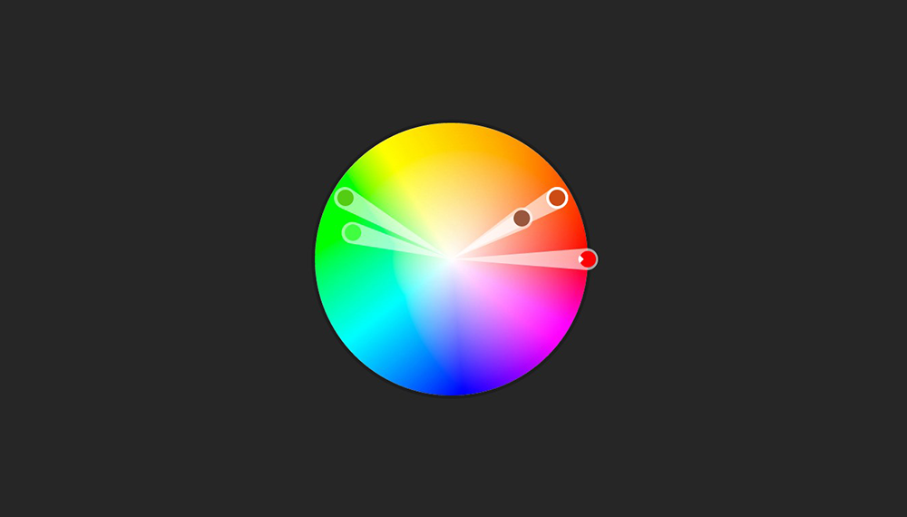

## 网页设计中隐藏在色彩之后的情感和心理学

> 译自 [The Psychology and Emotion Behind Color in Web Design](http://blogs.adobe.com/dreamweaver/2015/10/the-psychology-and-emotion-behind-color-in-web-design.html)

当我在2000年中旬的时候，还是一个非常糟糕的设计师。

讲真，都没法说了。

这并不是说我对于那个工具或者什么鬼的东西手足无措，而问题出在其他地方：

**颜色**

如果用一句话来总结我的缺点，那就是：我并不是为了要达成的目标或者网站所要吸引的用户而使用一些颜色，而是根据自己的个人喜好去用他们。

比如吧，亮绿色简直就是我绳命里的最爱，然后你猜猜发生了什么。。。我早期的设计生涯简直一片绿，就没其他东西了。

“hey我喜欢绿色人人都喜欢绿色，所以网站也得是绿色的！”---这真的不是一个运用颜色的好思路

但后来，我意识到，也许当你对网站进行设计的时候，需要对颜色的选择进行更深入的思考。那并不是一个三秒的头脑风暴就能决定的了的。它不像站点logo配色那样，而是一个更加完整和巨大的问题。更何况，颜色或许还是设计师最有效有力的一个工具

正如科学所证明的那样，颜色会引发特定的感情。你还可以[戳这里](http://www.informationisbeautiful.net/visualizations/colours-in-cultures/)瞅瞅色彩与感情的关联。

那么，如何找到一个适合你的(色彩设计)方法呢？如何为了达成一个目标，或是设计一个网站或者面向一些特定的用户群体，而正确的运用色彩呢？来来来让我们试着回答这些问题。

