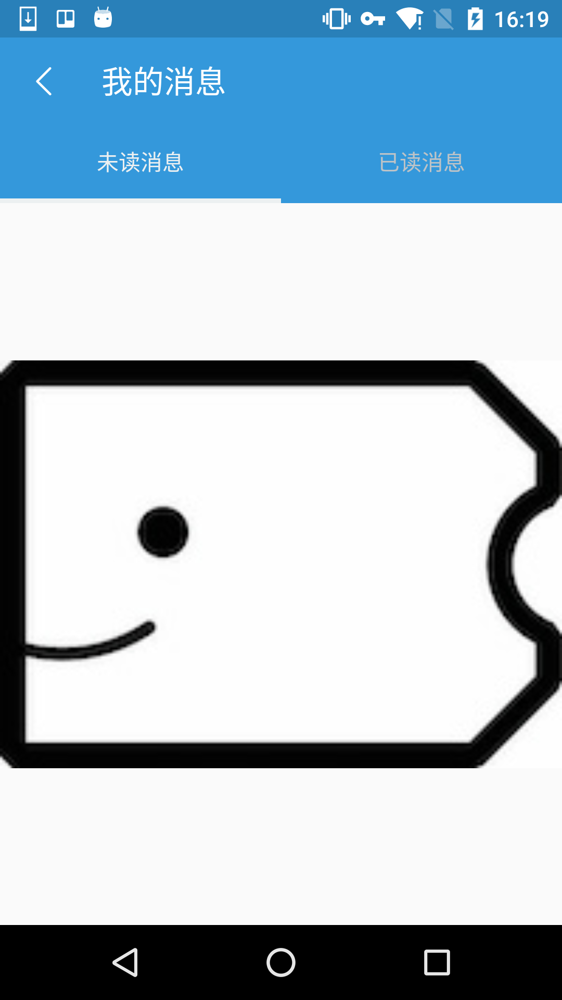
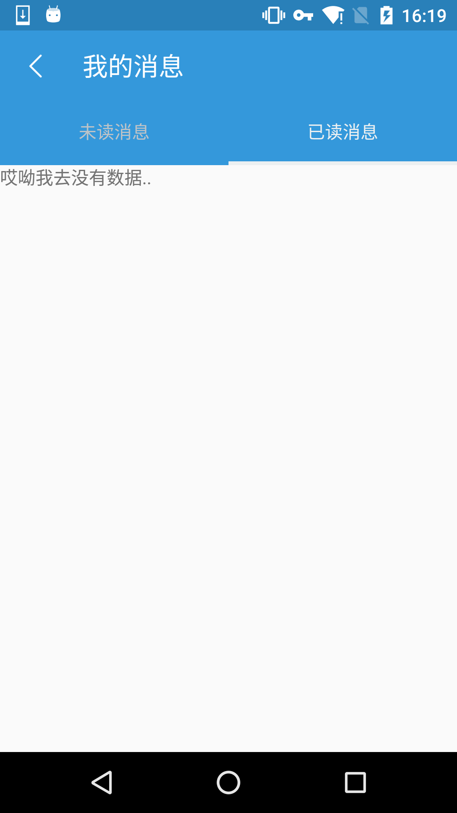
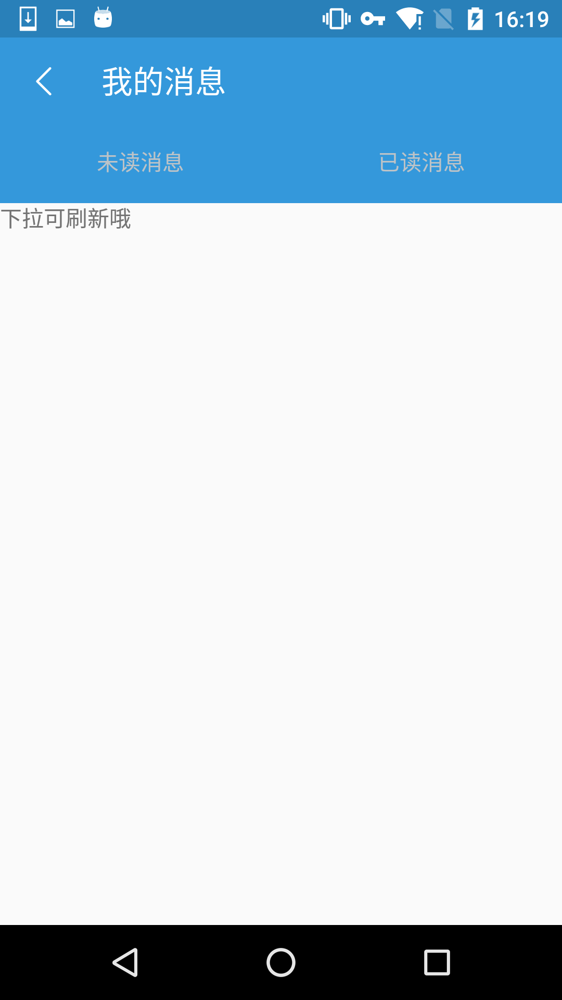

## ReactNative-自定义组件ViewPagerAndroid

### INTRO

最初接触ReactNative的时候，觉得它的性能和UI方面很弱，只能做出一些原生应用的基本功能，比如阅读类的偏重于浏览的应用，而不适合做多交互和动效的应用。最近进一步学习了它后发现，配合Redux的ReactNative，通过发挥组件分离复用的思想，依旧可以做出很漂亮的App

Redux为数据与UI分离提供了可能，那么我们可以开始着手进行一些UI的封装定制。首先从`ViewPagerAndroid`开始吧。

ViewPager算是Android中的老牌组件了吧。在Android中，配合一个适配器`PagerAdapter`，一个`PagerTitleStrip `,各种玩的花。然而在ReactNative中就没那么爽了（起码目前）

ReactNative里的ViewPager，只提供了基础了pager功能：提供多个View加载进ViewPagerAndroid内部，可以通过左右滑动切换页面。没有Tab的显示和操作

```javascript
return (
    <ViewPagerAndroid
      style={styles.viewPager}
      initialPage={0}>
      <View style={styles.pageStyle}>
        <Text>First page</Text>
      </View>
      <View style={styles.pageStyle}>
        <Text>Second page</Text>
      </View>
    </ViewPagerAndroid>
);
```

我们怎能甘心与此。ViewPagerAndroid中提供了页面切换的回调，那么时候自己封装一个玩玩了

### 目录结构

```javascript
- EcViewPagerAndroid
-- index.js
-- EcEmptyContainer.js // 处理没有数据的情况
-- EcViewPagerContainer.js // 放置在ViewPager中
-- EcViewPagerTitle.js // 定义头部的tab
```

### 代码

```javascript
// EcViewPagerAndroid/EcViewPagerTitle.js
class EcViewPagerTitle extends Component {
 
  onPageChange() {
    let {onPageChange, index} = this.props;
    onPageChange(index);
  }

  render() {
    // 自定义了tab，需要从父组件传入index和activeIndex，以渲染不同UI
    let {activeIndex, title, index} = this.props;

    return (
      <View style={styles.topBarContainer}>
        <TouchableOpacity style={styles.topBarTouchArea} onPress={this.onPageChange.bind(this)}>
          <View style={styles.topBarTop}>
            <Text style={[styles.topBarText, activeIndex === index && styles.topBarTextActive]}>{this.props.title}</Text>
          </View>
          <View style={[styles.topBarBottom, activeIndex === index && styles.topBarBottomActive]}></View>
        </TouchableOpacity>
      </View>
    )
  }
}

const styles = StyleSheet.create({
  topBarContainer: {
    height: 50,
    flex: 1,
  },
  topBarTouchArea: {
    height: 50,
    flex: 1
  },
  topBarTop: {
    alignItems: 'center',
    justifyContent: 'center',
    flex: 1,
  },
  topBarBottom: {
    height: 3,
  },
  topBarText: {
    color: '#bdc3c7',
  },
  topBarTextActive: {
    color: '#ecf0f1',
  },
  topBarBottomActive: {
    backgroundColor: '#ecf0f1',
  }
})

export default EcViewPagerTitle;
```

```javascript
// EcViewPagerAndroid/EcViewPagerContainer.js
class TeeViewPagerContent extends Component {
  
  render() {
    // 只是将传入的pager组合进View中
    return (
      <View style={styles.listviewPager}>
        {this.props.pager}
      </View>
    )
  }
}

const styles = StyleSheet.create({
  listviewPager: {
    flex: 1,
  }
});

export default TeeViewPagerContent;
```

```javascript
// EcViewPagerAndroid/index.js
import EcViewPagerTitle from './EcViewPagerTitle';
import EcViewPagerContent from './EcViewPagerContent';

const VIEW_PAGER = 'TeeViewPager';

/*
* props
* 接收的props
* viewPagerTitles: [string]
*
* viewPagerPages: [Component]
* 
* 如果愿意的话，也可以改为{title: component}的对象传入
 */

class EcViewPagerAndroid extends Component {
  constructor(props, context) {
    super(props, context);
    this.state = {
      // 组件内部控制当前显示pager的state，我认为没有必要暴露到全局
      activeIndex: 0
    };
  }

  onPageChange(pageIndex) {
    if(pageIndex === this.state.activeIndex){
      return false;
    };
    // 在点击tab的时候，通过setPage和LayoutAnimation达到pager切换的动画效果
    LayoutAnimation.configureNext(LayoutAnimation.Presets.spring);
    this.setState({
      activeIndex: pageIndex
    });
    this.refs[VIEW_PAGER].setPage(pageIndex);
  }

  onPageSelected(e) {
    this.onPageChange(e.nativeEvent.position);
  }

  render() {

    let {viewPagerTitles, viewPagerPages} = this.props;
    let activeIndex = this.state.activeIndex;
    // 分别遍历props，将其组合起来
    let pagerTitles = viewPagerTitles.map((title, index) => {
      return (
        <TeeViewPagerTitle
          key={index}
          index={index}
          title={title}
          onPageChange={this.onPageChange.bind(this)}
          activeIndex={activeIndex}
        />
      )
    });

    let pagerContents = viewPagerPages.map((pager, index) => {
      return (
        <TeeViewPagerContent pager={pager} key={index} />
      )
    });

    return (
      <View style={styles.teeViewPagerContainer}>
        <View style={styles.topBar}>
          {pagerTitles}
        </View>
        <ViewPagerAndroid
          style={styles.viewPager}
          keyboardDismissMode='on-drag'
          initialPage={activeIndex}
          ref={VIEW_PAGER}
          onPageSelected={this.onPageSelected.bind(this)}
        >
        {pagerContents}
        </ViewPagerAndroid>
      </View>
    )
  }
}

const styles = StyleSheet.create({
  teeViewPagerContainer: {
    flex: 1,
    flexDirection: 'column'
  },
  topBar: {
    height: 50,
    backgroundColor: '#3498db',
    flexDirection: 'row',
    alignItems: 'center',
    justifyContent: 'center',
  },
  viewPager: {
    flex: 1,
  },
});

export default EcViewPagerAndroid;
```

以上，一个大致的自定义ViewPagerAndroid已经完成了。在使用的时候，只要传入数组格式的titles和pagers就可以了

```javascript
import PageOne from './Page/PageOne';
import PageTwo from './Page/PageTwo';
import EcViewPagerAndroid from '../EcViewPagerAndroid/index';

render() {
  let titles = ['page1', 'page2'];
  let pageOne = (
    <PageOne data={data1} onItemClick={this.onItemClick.bind(this)} />
  );
  let pageTwo = (
    <PageOne data={data2} onItemClick={this.onItemClick.bind(this)} />
  );
  let pagers = [pageOne, pageTwo];
  return (
    <EcViewPagerAndroid
      viewPagerTitles={titles}
      viewPagerPages={pagers}
    />
  )
}
```

完毕。

---

你以为这样就完了？Too young too simple啊

### 坑1

ViewPager里放什么？View啊！那么好的，来让我们先做一个EmptyContainer，作为没有数据时的占位符

```javascript
// ECEmptyContainer.js
class TeeEmptyContainer extends Component {
  
  render() {
    return (
      <View style={styles.defaultViewContainer}>
        <View style={styles.defaultView}>
          <Image resizeMode='contain' source={require('../../src/image/logo.jpg')} style={styles.defaultImage}/>
          <Text>哎呦我去没有数据..</Text>
          <Text>下拉可刷新哦</Text>
        </View>
      </View>
    )
  }
}

const styles = StyleSheet.create({
  defaultViewContainer: {
    flex: 1,
    justifyContent: 'center',
    alignItems: 'center'
  },
  defaultView: {
    height: 100,
    flex: 1,
    justifyContent: 'center',
    alignItems: 'center'
  },
  defaultImage: {
    height: 60
  }
});

export default TeeEmptyContainer;
```

大功告成。让我们代入EcViewPagerAndroid试试看。然后。。等着傻眼吧。

WTF？我们只扔进去一个组件，应该只有一个pager，但居然深井冰般的出现了三个。





钻研半天。。好吧我只能说这可能是个bug吧（或者我写的有问题喽）。通过这种方式组件的ViewPager，pager组件只能有两层嵌套，再多就会被当做其他的pager。

那该怎么做一个EmptyContainer？使用ListView，内部只渲染充满屏幕的一行就好了：

```javascript
class TeeEmptyContainer extends Component {

  render() {
    // 只有一行数据，作为占位
    let dataSource = new ListView.DataSource({rowHasChanged: (r1, r2) => r1 !== r2});
    let listData = dataSource.cloneWithRows([1]);
    return (
      <View style={styles.emptyContainer}>
        <ListView
          enableEmptySections={true}
          style={styles.emptyListView}
          dataSource={listData}
          renderRow={(data) => {
            return (
              <View style={styles.defaultViewContainer}>
                <View style={styles.defaultView}>
                  <Image resizeMode='contain' source={require('../../src/image/logo.jpg')} style={styles.defaultImage}/>
                  <Text>哎呦我去没有数据..</Text>
                  <Text>下拉可刷新哦</Text>
                </View>
              </View>
            )
          }}
        />
      </View>
    )
  }
}

const styles = StyleSheet.create({
  emptyContainer: {
    flex: 1,
  },
  emptyListView: {
    flex: 1
  },
  defaultViewContainer: {
    flex: 1,
    height: 400,
    justifyContent: 'center',
    alignItems: 'center'
  },
  defaultView: {
    height: 100,
    flex: 1,
    justifyContent: 'center',
    alignItems: 'center'
  },
  defaultImage: {
    height: 60
  }
});

export default TeeEmptyContainer;
```

### 坑2

ReactNative的ListView中，自带了几个便利的方法：

```javascript
onEndReached={function}
// 当所有的数据都已经渲染过，并且列表被滚动到距离最底部不足onEndReachedThreshold个像素的距离时调用。原生的滚动事件会被作为参数传递。

onEndReachedThreshold={number}
// 调用onEndReached之前的临界值，单位是像素。
```

因此，我们可以在列表滚动到底部的时候，发送请求fetch下一页的数据，之后更新到state中，就可以轻松的实现如同原生分页般的顺滑体验

但是，当它和上面的自定义ViewPager配合的时候，就会出现诡异的现象：

当ViewPager滚动到底部触发fetch事件，并获取到数据更新了state之后，ListView会被压缩至原来的一半高，下半部的ListView中的内容没有被渲染（但ListView依旧全部占满屏幕）！

坑爹玩意！

目前解决方案:

ListView中有一个不起眼的方法：

```javascript
renderScrollComponent={function}
// 指定一个函数，在其中返回一个可以滚动的组件。ListView将会在该组件内部进行渲染。默认情况下会返回一个包含指定属性的ScrollView。
```

文档里没有详细介绍，但在最新版英文文档ListView的例子里有它：

```javascript
var React = require('react-native');
var {
  ListView,
  RecyclerViewBackedScrollView,
  View,
} = React;

<ListView
  dataSource={this.state.dataSource}
  renderRow={this._renderRow}
  renderScrollComponent={props => <RecyclerViewBackedScrollView {...props} />}
  renderSeparator={(sectionID, rowID) => <View key={`${sectionID}-${rowID}`} style={styles.separator} />}
/>
```

所以我们在使用的时候：

```javascript
return (
  <ListView
    dataSource={listData}
    initialListSize = {LOAD_NUM}
    onEndReached = {this.canLoadMore.bind(this)}
    onEndReachedThreshold = {LIST_END_REACH}
    enableEmptySections={true}
    // IMPORTANT
    renderScrollComponent={props => <RecyclerViewBackedScrollView {...props} />}
    renderRow={(row)=>{}}
  />
)
```
然后就解决问题了==