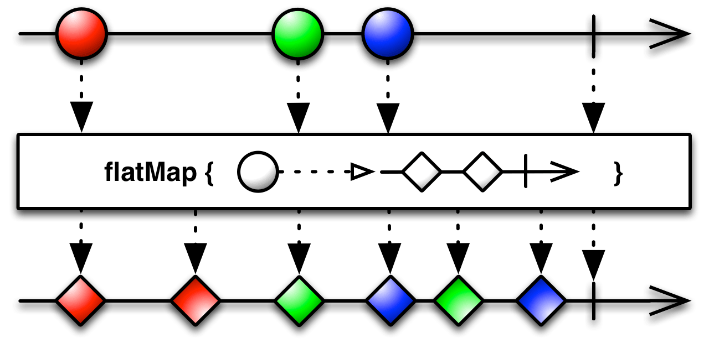
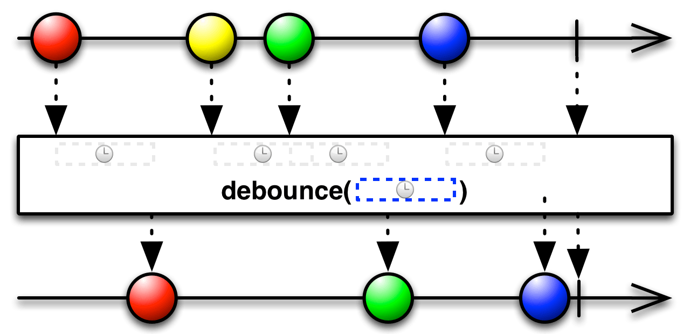
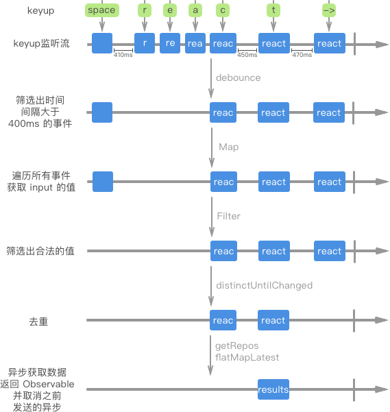

<!-- START doctoc generated TOC please keep comment here to allow auto update -->
<!-- DON'T EDIT THIS SECTION, INSTEAD RE-RUN doctoc TO UPDATE -->
**Table of Contents**  *generated with [DocToc](https://github.com/thlorenz/doctoc)*

- [探索 RxJS - 做一个 github 小应用](#%E6%8E%A2%E7%B4%A2-rxjs---%E5%81%9A%E4%B8%80%E4%B8%AA-github-%E5%B0%8F%E5%BA%94%E7%94%A8)
- [Let's start](#lets-start)
  - [初始化 DOM 事件流](#%E5%88%9D%E5%A7%8B%E5%8C%96-dom-%E4%BA%8B%E4%BB%B6%E6%B5%81)
  - [实时进行异步获取](#%E5%AE%9E%E6%97%B6%E8%BF%9B%E8%A1%8C%E5%BC%82%E6%AD%A5%E8%8E%B7%E5%8F%96)
  - [优化事件流](#%E4%BC%98%E5%8C%96%E4%BA%8B%E4%BB%B6%E6%B5%81)
  - [流的监听](#%E6%B5%81%E7%9A%84%E7%9B%91%E5%90%AC)
- [APIS](#apis)
- [扩展阅读](#%E6%89%A9%E5%B1%95%E9%98%85%E8%AF%BB)

<!-- END doctoc generated TOC please keep comment here to allow auto update -->

## 探索 RxJS - 做一个 github 小应用

本文是一篇 RxJS 实战教程，利用 RxJS 和 github API 来一步步做一个 github 小应用。因此，文章的重点是解释 RxJS 的使用，而涉及的 ES6语法、webpack 等知识点不予讲解。

> 本例的所有代码在 github 仓库：[rxjs-example](https://github.com/ecmadao/rxjs-example)

首先要注意的是，目前在 github 上有两个主流 RxJS，它们代表不同的版本：

- [ReactiveX - rxjs](https://github.com/ReactiveX/rxjs) RxJS 5 beta 版
- [Reactive-Extensions - RxJS](https://github.com/Reactive-Extensions/RxJS) RxJS 4.x 稳定版

这两个版本的安装和引用稍有不同：

```bash
# 安装 4.x 稳定版
$ npm install rx --save
# 安装 5 beta 版
$ npm install rxjs --save
```

```javascript
// 4.x 稳定版
import Rx from 'rx';
// 5 beta 版
import Rx from 'rxjs/Rx';
```

除此以外，它们的语法也稍有不同，比如在 5 beta 版里，`subscribe`时可以代入一个对象作为参数，也可以代入回调函数作为参数，而 4.x 版则只支持以回调函数为参数的情况：

```javascript
// 5 beta
var observer = {
  next: x => console.log('Observer got a next value: ' + x),
  error: err => console.error('Observer got an error: ' + err),
  complete: () => console.log('Observer got a complete notification'),
};
Observable.subscribe(observer);

// 5 和 4.x 都支持：
Observable.subscribe(x => console.log(x), (err) => console.log(err), () => console.log('completed'));
```

其他更多语法不同可以参考：

- [4.x 稳定版 Document](https://github.com/Reactive-Extensions/RxJS/tree/master/doc)
- [5 beta 版 Document](http://reactivex.io/rxjs/manual)
- [从 4 到 5 的迁移](https://github.com/ReactiveX/rxjs/blob/master/MIGRATION.md)

## Let's start

如上所说，我们要利用 RxJS 和 github API 来一步步做一个 github 小应用。首先完成其基本功能，即通过一个 input 输入文字，并实时根据 input 内值的变化去发送异步请求，调用 github API 进行搜索。如图所示（[线上 Demo](https://ecmadao.github.io/rxjs-example)）：

> 通过`RxJS`，在输入过程中实时进行异步搜索：


> `hover`到 avator 上之后异步获取用户信息


安装 webpack 配置编译环境，并使用 ES6 语法。安装如下依赖，并配置好 webpack：

- webpack
- webpack-dev-server
- babel-loader
- babel-preset-es2015
- html-webpack-plugin
- css-loader / postcss 及其他
- jquery
- rx（4.x 版本）

通过`webpack-dev-server`，我们将会启动一个 8080 端口的服务器，使得我们编译好的资源可以在`localhost:8080/webpack-dev-server`访问到。

### 初始化 DOM 事件流

在`index.html`中编写一个`input`，我们将在`index.js`中，通过 RxJS 的 Observable 监听`input`的`keyup`事件。可以使用[`fromEvent`](http://reactivex.io/documentation/operators/from.html)来创建一个基于 DOM 事件的流，并通过[`map`](http://reactivex.io/documentation/operators/map.html)和[`filter`](http://reactivex.io/documentation/operators/filter.html)进一步处理。

```html
<!-- index.html -->
<input class="search" type="text" maxlength="1000" required placeholder="search in github"/>
```

```javascript
// src/js/index.js
import Rx from 'rx';

$(() => {
  const $input = $('.search');
  // 通过 input 的 keyup 事件来创建流
  const observable = Rx.Observable.fromEvent($input, 'keyup')
  	// 并获取每次 keyup 时搜索框的值，筛选出合法值
  	.map(() => $input.val().trim())
    .filter((text) => !!text)
    // 利用 do 可以做一些不影响流的事件，比如这里打印出 input 的值
    .do((value) => console.log(value));
  // 开启监听
  observable.subscribe();
});
```

去 input 里随便打打字，可以看到我们已经成功监听了`keyup`事件，并在每次`keyup`时在 console 里输出 input 当前的值。

### 实时进行异步获取

监听了 input 事件，我们就能够在每次`keyup`时拿到 value，那么就可以通过它来异步获取数据。将整个过程拆分一下：

1. 用户在 input 里输入任意内容
2. 触发`keyup`事件，获取到当前 value
3. 将 value 代入到一个异步方法里，通过接口获取数据
4. 利用返回数据渲染 DOM

也就是说，我们要把原有的 Observable 中每个事件返回的 value 进行异步处理，并使其返回一个新的 Observable。可以这么处理：

1. 让每个 value 返回一个 Observable
2. 通过[`flatMap`](http://reactivex.io/documentation/operators/flatmap.html)将所有的 Observable 扁平化，成为一个新的 Observable

图解`flatMap`：



而既然需要异步获取数据，那么在上面的第一步时，可以通过[`fromPromise`](http://reactivex.io/documentation/operators/from.html)来创建一个 Observable：

```javascript
// src/js/helper.js
const SEARCH_REPOS = 'https://api.github.com/search/repositories?sort=stars&order=desc&q=';

// 创建一个 ajax 的 promise
const getReposPromise = (query) => {
  return $.ajax({
  	type: "GET",
    url: `${SEARCH_REPOS}${query}`,
  }).promise();
};
// 通过 fromPromise 创建一个 Observable
export const getRepos = (query) => {
  const promise = getReposPromise(query);
  return Rx.Observable.fromPromise(promise);
};
```

```javascript
// src/js/index.js
import {getRepos} from './helper';

// ...
const observable = Rx.Observable.fromEvent($input, 'keyup')
  	.map(() => $input.val())
    .filter((text) => !!text)
    .do((value) => console.log(value))
    // 调用 getRepos 方法将返回一个 Observable
    // flatMap 则将所有 Observable 合并，转为一个 Observable
    .flatMap(getRepos);
// ...
```

这样，每一次`keyup`的时候，都会根据此时 input 的 value 去异步获取数据。但这样做有几个问题：

- 不断打字时会连续不断触发异步请求，占用资源影响体验
- 如果相邻的`keyup`事件触发时 input 的值一样，也就是说按下了不改变 value 的按键（比如方向键），会重复触发一样的异步事件
- 发出多个异步事件之后，每个事件所耗费的时间不一定相同。如果前一个异步所用时间较后一个长，那么当它最终返回结果时，有可能把后面的异步率先返回的结果覆盖

所以接下来我们就处理这几个问题。

### 优化事件流

针对上面的问题，一步一步进行优化。

---

> 不断打字时会连续不断触发异步请求，占用资源影响体验

也就是说，当用户在连续打字时，我们不应该继续进行之后的事件处理，而如果打字中断，或者说两次`keyup`事件的时间间隔足够长时，才应该发送异步请求。针对这点，可以使用 RxJS 的[`debounce`](http://reactivex.io/documentation/operators/debounce.html)方法：



如图所示，在一段时间内事件被不断触发时，不会被之后的操作所处理；只有超过指定时间间隔的事件才会留下来：

```javascript
// src/js/index.js
// ...
const observable = Rx.Observable.fromEvent($input, 'keyup')
	// 若 400ms 内连续触发 keyup 事件，则不会继续往下处理
	.debounce(400)
  	.map(() => $input.val())
    .filter((text) => !!text)
    .do((value) => console.log(value))
    .flatMap(getRepos);
// ...
```

---

> 如果相邻的`keyup`事件触发时 input 的值一样，也就是说按下了不改变 value 的按键（比如方向键），会重复触发一样的异步事件

也就是说，对于任意相邻的事件，如果它们的返回值一样，则只要取一个（重复事件中的第一个）就好了。可以利用[`distinctUntilChanged`](http://reactivex.io/documentation/operators/distinct.html)方法：


```javascript
// src/js/index.js
// ...
const observable = Rx.Observable.fromEvent($input, 'keyup')
	.debounce(400)
  	.map(() => $input.val())
    .filter((text) => !!text)
    // 只取不一样的值进行异步
    .distinctUntilChanged()
    .do((value) => console.log(value))
    .flatMap(getRepos);
// ...
```

---

> 发出多个异步事件之后，每个事件所耗费的时间不一定相同。如果前一个异步所用时间较后一个长，那么当它最终返回结果时，有可能把后面的异步率先返回的结果覆盖

这个蛋疼的问题我相信大家很可能遇见过。在发送多个异步请求时，因为所用时长不一定，无法保障异步返回的先后顺序，所以，有时候可能**早请求的异步的结果会覆盖后来请求的异步结果**。

而这种情况的处理方式就是，在连续发出多个异步的时候，既然我们期待的是最后一个异步返回的结果，那么就可以把之前的异步取消掉，不 care 其返回了什么。因此，我们可以使用[`flatMapLatest`](http://reactivex.io/documentation/operators/flatmap.html) API（类似于 RxJava 中的`switchMap` API）

通过`flatMapLatest`，当 Observable 触发某个事件，返回新的 Observable 时，将取消之前触发的事件，并且不再关心返回结果的处理，只监视当前这一个。也就是说，发送多个请求时，不关心之前请求的处理，只处理最后一次的请求：


```javascript
// src/js/index.js
// ...
const observable = Rx.Observable.fromEvent($input, 'keyup')
	.debounce(400)
  	.map(() => $input.val())
    .filter((text) => !!text)
    .distinctUntilChanged()
    .do((value) => console.log(value))
    // 仅处理最后一次的异步
    .flatMapLatest(getRepos);
// ...
```

### 流的监听

至此，我们对 input `keyup`以及异步获取数据的整个事件流处理完毕，并进行了一定的优化，避免了过多的请求、异步返回结果错乱等问题。但创建了一个流之后也有对其进行监听：

```javascript
// src/js/index.js
// ...
const observable = Rx.Observable.fromEvent($input, 'keyup')
	.debounce(400)
  	.map(() => $input.val())
    .filter((text) => !!text)
    .distinctUntilChanged()
    .do((value) => console.log(value))
    .flatMapLatest(getRepos);
// 第一个回调中的 data 代表异步的返回值
observable.subscribe((data) => {
  // 在 showNewResults 方法中使用返回值渲染 DOM
  showNewResults(data);
}, (err) => {
  console.log(err);
}, () => {
  console.log('completed');
});
```

---

这样，一个通过 RxJS 监听事件的流已经完全建立完毕了。整个过程使用图像来表示则如下：



而如果我们不使用 RxJS，用传统方式监听 input 的话：

```javascript
// src/js/index.js
import {getRepos} from './helper';

$(() => {
  const $input = $('.search');
  const interval = 400;
  var previousValue = null;
  var fetching = false;
  var lastKeyUp = Date.now() - interval;
  $input.on('keyup', (e) => {
    const nextValue = $input.val();
	if (!nextValue) {
      return;
	}
	if (Date.now() - lastKeyUp <= interval) {
      return;
	}
	lastKeyUp = Date.now();
	if (nextValue === previousValue) {
      return;
	}
	previousValue = nextValue;
    if (!fetching) {
      fetching = true;
      getRepos(nextValue).then((data) => {
      	fetching = false;
        showNewResults(data);
      });
    }
  });
});
```

挺复杂了吧？而且即便如此，这样的处理还是不够到位。上面仅仅是通过`fetching`变量来判断是否正在异步，如果正在异步，则不进行新的异步；而我们更希望的是能够取消旧的异步，只处理新的异步请求。

## APIS

栗子中使用到的 RxJS API：

- [fromEvent](http://reactivex.io/documentation/operators/from.html) 通过 DOM 事件来创建流
- [debounce](http://reactivex.io/documentation/operators/debounce.html) 如果在一定时间内流中的某个事件不断被触发，则不会进行之后的事件操作
- [map](http://reactivex.io/documentation/operators/map.html) 遍历流中所有事件，返回新的流
- [filter](http://reactivex.io/documentation/operators/filter.html) 筛选流中所有事件，返回新的流
- [flatMapLatest](http://reactivex.io/documentation/operators/flatmap.html)
- [distinctUntilChanged](http://reactivex.io/documentation/operators/distinct.html) 流中如果相邻事件的结果一样，则仅筛选出一个（剔除重复值）

## 扩展阅读

- [What does RxJS observable debounce do](http://stackoverflow.com/questions/30840247/what-does-rxjs-observable-debounce-do)
- [How do I work with jQuery and RxJS](https://github.com/Reactive-Extensions/RxJS/blob/master/doc/howdoi/jquery.md)
- [Introduction of observable operators](http://reactivex.io/documentation/operators.html)
- [文章源码 - rxjs-example](https://github.com/ecmadao/rxjs-example)