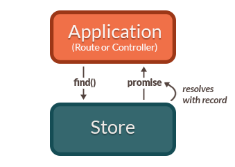

## Ember初步--Model

model相当于应用的数据结构。它应该是可持续化的。这意味着当用户离开当前窗口时，不期望会有数据丢失的情况发生。因此，当用户对model的数据做出改变的时候，你需要把它在什么地方储存起来。

通常来说，大多数的model都储存/获取自存储数据的server，一般你需要通过http请求以JSON的形式拿到它。但Ember提供了更简便的形式，比如通过IndexedDB存在用户的硬盘里或者通过Ember Data把数据储存在你的服务器上。当你从储存中加载好model以后，组件会把model的数据加载到UI层上。

当你新建一个Ember项目的时候，会自动安装Ember Data库。它的作用是把model转化为JSON格式传递给你的server，并从server获取更新后的数据，生产新的model。

假设没有model，我们有组件需要异步获取数据，则可以这么写：

```javascript
// app/components/list-of-drafts.js
import Ember from 'ember';

export default Ember.Component.extend({
  willRender() {
    $.getJSON('/drafts').then(data => {
      this.set('drafts', data);
    });
  }
});
```

然后在模板里渲染：

```html
<!-- app/templates/components/list-of-drafts.hbs -->
<ul>
  {{#each drafts key="id" as |draft|}}
    <li>{{draft.title}}</li>
  {{/each}}
</ul>
```

但如果有其他组件要获取一样的数据，但是模板又不一样的时候，我们就要重复书写组件里的异步过程。这种情况我们可以通过model的store来优化。获取数据的时候component会先去store寻找，没有的话才会去请求数据。而多个组件可以共享同一个store，store里数据的改变会在不同模板的UI上展现。

### Model概览

#### Model

在Ember Data里，每个model都是`DS.Model`的子类，它们定义了数据的类型和结构：

```javascript
// app/models/person.js
import DS from 'ember-data';

export default DS.Model.extend({
    firstName: DS.attr('string'),
    birthday: DS.attr('date')
});
```

model定义不同对象之间的关系。例如，`order`可能由许多`line-items`组成，而`line-item`则属于一个特定的`order`：

```javascript
// app/models/order.js
import DS from 'ember-data';
export default DS.Model.extend({
  lineItems: DS.hasMany('line-item')
});
```

```javascript
// app/models/line-item.js
import DS from 'ember-data';
export default DS.Model.extend({
  order: DS.belongsTo('order')
});
```

model自身并不具有数据，它们只是定义数据属性、结构和一些特定的行为。这些统称为`records`

#### Records

一个`record`是一个model实例，它从server中获取并含有相应的数据。你也可以新建`record`并把它储存起来。

每个`record`通过model的`type`和`ID`来识别。

例如，在一个联系人管理的APP里，有一个叫`Person`的model，而其中有一条`record`，它的type是person，ID是1：

```javascript
this.get('store').findRecord('person', 1); // => { id: 1, name: 'steve-buscemi' }
```

ID通常由server提供，在储存数据的时候自动绑定。

#### Adapter

adapter将Ember的请求（例如："find the user with an ID of 1"）转化为对server的请求。当应用请求的数据没有被缓存时，就会通过adapter对server进行请求

#### Caching

store会自动缓存record的查询记录，下次查询的时候会先从store拿取数据，以便减少对server的请求。

#### 架构一览


而当数据被缓存时：



### 定义Model

#### 创建model

```bash
# 新建person model
$ ember g model person
```

```javascript
// app/models/person.js
import DS from 'ember-data';

export default DS.Model.extend({
});
```

#### 定义Attributes

```javascript
import DS from 'ember-data';

export default DS.Model.extend({
  firstName: DS.attr(),
  lastName: DS.attr(),
  birthday: DS.attr()
});
```

当从server解析获取的JSON数据，以及把存储修改的record时，定义的Attributes都会起到过滤、转换的作用。

在model中，你可以像component的属性一样来使用model的属性，甚至可以使用计算属性：

```javascript
// app/models/person.js
import DS from 'ember-data';

export default DS.Model.extend({
  firstName: DS.attr(),
  lastName: DS.attr(),

  fullName: Ember.computed('firstName', 'lastName', function() {
    return `${this.get('firstName')} ${this.get('lastName')}`;
  })
});
```

#### 指定类型

##### 基本类型

仅仅像上面那样的定义是远远不够的，因为我们根本没有限制属性的类型。Ember Data支持的基本类型有`string`、`number`、`boolean`、`date`，我们可以在`DS.attr()`中定义：

```javascript
// app/models/person.js
import DS from 'ember-data';

export default DS.Model.extend({
  name: DS.attr('string'),
  age: DS.attr('number'),
  admin: DS.attr('boolean'),
  birthday: DS.attr('date')
});
```

##### 自定义类型

使用Ember CLI的`transform`来生成自定义类型：

```bash
$ ember g transform dollars
```

```javascript
// app/transforms/dollars.js
import DS from 'ember-data';

export default DS.Transform.extend({
  deserialize: function(serialized) {
    return serialized / 100; // returns dollars
  },

  serialize: function(deserialized) {
    return deserialized * 100; // returns cents
  }
});
```

一个transform有两个方法：序列化`serialize`和反序列化`deserialize`

`deserialize`用于将数据转换为客户端所期待的格式，而`serialize`则把数据转换为服务端期待的格式：

```javascript
// app/models/product.js
import DS from 'ember-data';

export default DS.Model.extend({
  spent: DS.attr('dollars')
});
```

#### Options

`DS.attr`可接受一个option。目前支持的option的参数是`defaultValue`，用于设置该属性的默认值。

`defaultValue`必须是一个值或者方法，最终都要返回该属性支持的类型的值。

```javascript
// app/models/user.js
import DS from 'ember-data';

export default DS.Model.extend({
  username: DS.attr('string'),
  email: DS.attr('string'),
  verified: DS.attr('boolean', { defaultValue: false }),
  createdAt: DS.attr('date', {
    defaultValue() { return new Date(); }
  })
});
```

### store对象

可以在`controller`或者`route-handler`中通过`this.get('store')`来获取store对象

### 查询

#### 查询单条数据

`store.findRecord()`: 接收model的type和record的ID，返回一个promise

```javascript
var blogPost = this.get('store').findRecord('blog-post', 1); // => GET /blog-posts/1
```

`store.peekRecord()`: 接收model的type和record的ID，不发送http请求，返回已经在store里存在的record

```javascript
var blogPost = this.get('store').peekRecord('blog-post', 1); // => no network request
```

#### 查询多条数据

`store.findAll()`

```javascript
var blogPosts = this.get('store').findAll('blog-post'); // => GET /blog-posts
```

`store.peekAll()`

```javascript
var blogPosts = this.get('store').peekAll('blog-post'); // => no network request
```

`store.findAll()`返回`DS.PromiseArray`，成功之后返回`DS.RecordArray`，而`store.peekAll()`则返回`DS.RecordArray`。

需要注意的是，`DS.RecordArray`并不是JS Array，而是`Ember.Enumerable`类型，因而直接使用`[index]`获取某一位置的数据是不可行的---需要使用`objectAt(index)`来获取。

#### 通过查询参数获取多数据

调用`store.query()`会发送一个`GET`请求，并把获取的Object作为查询参数传入。该方法和`findAll`一样返回`DS.PromiseArray`。

例如，下面这段代码会筛选出名字是Peter的人：

```javascript
// GET to /persons?filter[name]=Peter
this.get('store').query('person', {
  filter: {
    name: 'Peter'
  }
}).then(function(peters) {
  // Do something with `peters`
});


```

#### 通过查询参数获取单数据

调用`store.queryRecord()`会发送一个`GET`请求，并把获取的Object作为查询参数传入。该方法返回一个Promise，最终获取到一个查询对象：

```javascript
// GET to /persons?filter[email]=tomster@example.com
this.get('store').queryRecord('person', {
  filter: {
    email: 'tomster@example.com'
  }
}).then(function(tomster) {
  // do something with `tomster`
});
```

### 创建/更新/删除 数据

#### 创建一条数据

`createRecord()`

```javascript
this.get('store').createRecord('post', {
  title: 'Rails is Omakase',
  body: 'Lorem ipsum'
});
```

#### 更新数据

```javascript
this.get('store').findRecord('person', 1).then(function(tyrion) {
  // ...after the record has loaded
  tyrion.set('firstName', "Yollo");
});
```

#### 持久储存

当你对`DS.Model`的实例调用`save()`方法的时候，会发起一个http请求。

在默认情况下，当创建一个新的数据的时候，Ember Data会发送一条`POST`请求：

```javascript
var post = store.createRecord('post', {
  title: 'Rails is Omakase',
  body: 'Lorem ipsum'
});

post.save(); // => POST to '/posts'
```

而更新一条已经存在的数据则会发送`PATCH`请求：

```javascript
store.findRecord('post', 1).then(function(post) {
  post.get('title'); // => "Rails is Omakase"

  post.set('title', 'A new post');

  post.save(); // => PATCH to '/posts/1'
});
```

当你改变数据某属性的值，而还没有保存时，可以通过数据的`hasDirtyAttributes`属性来分辨它是否被改变，而且还可以通过`changedAttributes()`方法获取数据被改变的属性，以及改变前后的属性值的对比`[oldValue, newValue]`：

```javascript
person.get('isAdmin');            //=> false
person.get('hasDirtyAttributes'); //=> false
person.set('isAdmin', true);
person.get('hasDirtyAttributes'); //=> true
person.changedAttributes();       //=> { isAdmin: [false, true] 
```

在这个时候（改变数据但还没save），你可以选择使用`save()`来保存变动，也可以使用`rollbackAttributes()`回滚到改动之前的状态。

> 如果这个数据是刚刚建立的，那么使用`rollbackAttributes()`则会将它从store中去除。

```javascript
person.get('hasDirtyAttributes'); //=> true
person.changedAttributes();       //=> { isAdmin: [false, true] }

person.rollbackAttributes();

person.get('hasDirtyAttributes'); //=> false
person.get('isAdmin');            //=> false
person.changedAttributes();       //=> {}
```

#### Promise

`save()`方法会返回一个promise：

```javascript
var post = store.createRecord('post', {
  title: 'Rails is Omakase',
  body: 'Lorem ipsum'
});

var self = this;

function transitionToPost(post) {
  self.transitionToRoute('posts.show', post);
}

function failure(reason) {
  // handle the error
}

post.save().then(transitionToPost).catch(failure);

// => POST to '/posts'
// => transitioning to posts.show route
```

#### 删除记录

对一条记录调用`deleteRecord()`之后，会将它标记为`isDeleted`，之后再通过`save()`方法就能将它删除。或者你也可以使用`destroyRecord()`来直接删除它：

```javascript
store.findRecord('post', 1, { backgroundReload: false }).then(function(post) {
  post.deleteRecord();
  post.get('isDeleted'); // => true
  post.save(); // => DELETE to /posts/1
});

// OR
store.findRecord('post', 2, { backgroundReload: false }).then(function(post) {
  post.destroyRecord(); // => DELETE to /posts/2
});
```
