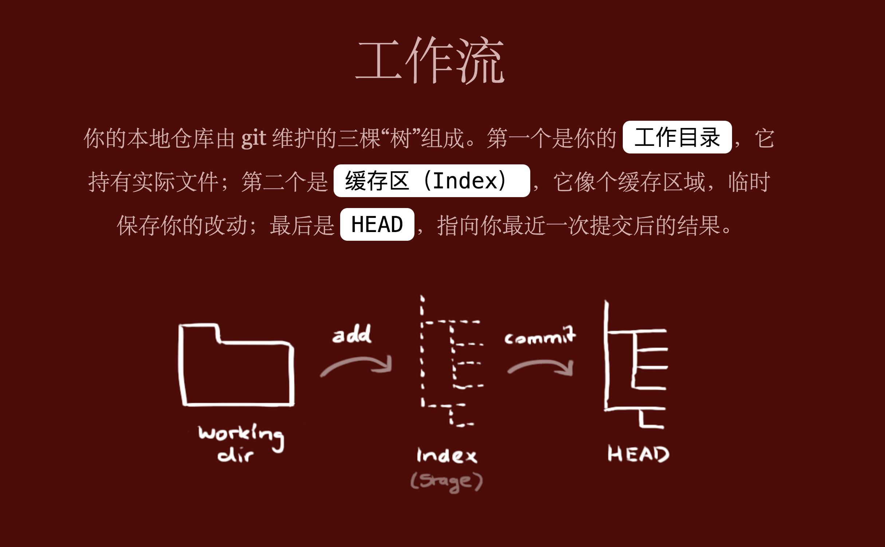
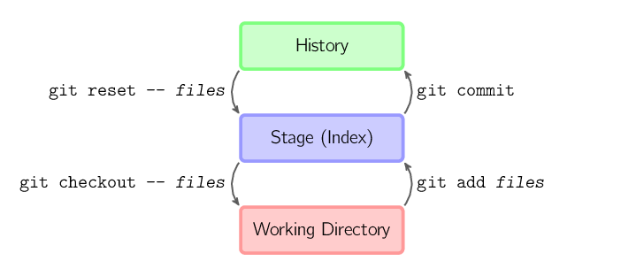
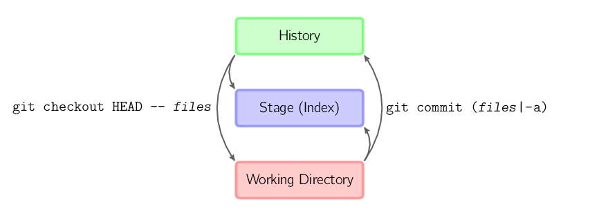

<!-- START doctoc generated TOC please keep comment here to allow auto update -->
<!-- DON'T EDIT THIS SECTION, INSTEAD RE-RUN doctoc TO UPDATE -->
**Table of Contents**  *generated with [DocToc](https://github.com/thlorenz/doctoc)*

- [Git创建](#git%E5%88%9B%E5%BB%BA)
- [Git版本控制](#git%E7%89%88%E6%9C%AC%E6%8E%A7%E5%88%B6)
    - [回滚版本](#%E5%9B%9E%E6%BB%9A%E7%89%88%E6%9C%AC)
    - [撤销修改](#%E6%92%A4%E9%94%80%E4%BF%AE%E6%94%B9)
    - [将文件从缓存区撤回到工作区：](#%E5%B0%86%E6%96%87%E4%BB%B6%E4%BB%8E%E7%BC%93%E5%AD%98%E5%8C%BA%E6%92%A4%E5%9B%9E%E5%88%B0%E5%B7%A5%E4%BD%9C%E5%8C%BA)
    - [撤销操作总结：](#%E6%92%A4%E9%94%80%E6%93%8D%E4%BD%9C%E6%80%BB%E7%BB%93)
    - [删除文件](#%E5%88%A0%E9%99%A4%E6%96%87%E4%BB%B6)
- [分支操作](#%E5%88%86%E6%94%AF%E6%93%8D%E4%BD%9C)
  - [分支操作时处理突发(bug)分支](#%E5%88%86%E6%94%AF%E6%93%8D%E4%BD%9C%E6%97%B6%E5%A4%84%E7%90%86%E7%AA%81%E5%8F%91bug%E5%88%86%E6%94%AF)
- [标签相关](#%E6%A0%87%E7%AD%BE%E7%9B%B8%E5%85%B3)

<!-- END doctoc generated TOC please keep comment here to allow auto update -->

---
title: git命令备忘
date: 2016-03-03 09:03:47
tags: git
---

部分摘自：
[常用 Git 命令清单](http://www.ruanyifeng.com/blog/2015/12/git-cheat-sheet.html)

## Git创建

在指定目录下，把该目录作为Git仓库：

```js
git init
```

添加文件到Git仓库：

```js
git add <file>
git commit -m "注释"
```

```js
git commit -a // 相当于运行 git add 把所有当前目录下的文件加入暂存区域再运行git commit
```

```js
git push origin [master] //将commit后的改动提交到远端仓库，可以把 master 换成你想要推送的任何分支
```

如果你还没有克隆现有仓库，并欲将你的仓库连接到某个远程服务器，你可以使用如下命令添加：

```js
git remote add origin <server>
```

查看当前仓库的状态：

```js
git status
```



## Git版本控制

查看文件修改前后的不同：

```js
git diff <filename>
```

查看提交日志：

```js
git log
git log --pretty=oneline //精简log输出信息
```

---

#### 回滚版本

在Git中，用HEAD表示当前版本
上一个版本就是HEAD^，上上一个版本就是HEAD^^，往上100个版本写成HEAD~100

```js
git reset --hard HEAD^ //回退到上一个版本
```

要从回退恢复的时候，可以用：

```js
git reflog
```

查看自己的每一次命令，可以看到各个版本的id，通过：

```js
git reset --hard id //恢复到指定id的版本
```

---

#### 撤销修改

```js
git checkout -- <file> //丢弃工作区的修改
```

命令`git checkout -- readme.txt`意思就是，把readme.txt文件在工作区的修改全部撤销，这里有两种情况：
- 一种是readme.txt自修改后还没有被放到暂存区，现在，撤销修改就回到和版本库一模一样的状态；
- 一种是readme.txt已经添加到暂存区后，又作了修改，现在，撤销修改就回到添加到暂存区后的状态。

总之，**`git checkout -- <file>`就是让这个文件回到最近一次`git commit`或`git add`时的状态。**

```js
git checkout HEAD -- <files> //回滚到复制最后一次提交
```



#### 将文件从缓存区撤回到工作区：

```js
git reset HEAD <file>
```



----

#### 撤销操作总结：

- 场景1：当你改乱了工作区某个文件的内容，想直接丢弃工作区的修改时，用命令`git checkout -- <file>`
- 场景1.5：当你已经提交到了缓冲区，但又做了错误修改，想撤销到刚提交到缓冲区时的样子，也是用命令`git checkout -- <file>`
- 场景2：当你不但改乱了工作区某个文件的内容，还添加到了暂存区时，想丢弃修改，分两步，第一步用命令`git reset HEAD <file>`，就回到了场景1，第二步按场景1操作。
- 场景3：已经提交了不合适的修改到版本库时，想要撤销本次提交，参考《回滚版本》一节，不过前提是没有推送到远程库

----

#### 删除文件

```js
git rm <filename>
```

- 删除之前修改过并且放到暂存区的话,则必须 git rm -f 文件强制删除.为了防止删除未add到缓存区的文件.
- 当你想缓存区和仓库都删除了某目录,但工作区保留 : `git rm --cached 目录/`

## 分支操作

```js
git branch //查看分支
git branch <name> //创建分支
git checkout <name> //切换分支
git checkout -b <name> //创建+切换分支
git merge <name> //合并某分支到当前分支
git branch -d <name> //删除分支
git branch -D <name> //强行删除 弃一个没有被合并过的分支
```

合并分支时，加上`--no-ff`参数就可以用普通模式合并，合并后的历史有分支，能看出来曾经做过合并，而fast forward合并就看不出来曾经做过合并。

```js
git merge <name> //fast forward模式合并分支，直接把master指向分支的当前提交
git merge --no-ff -m "note" <name> //普通模式合并分支，需要-m再一次提交
```

---

### 分支操作时处理突发(bug)分支
在当前分支(branch1)不能commit提交的情况下，通过：

```js
git stash
```

储存先分支的修改，之后可回到master分支，新建bug fix分支
修改完之后提交合并bug fix分支，切换回branch1分支，通过：

```js
git merge master
```

将bug修复后的情况同步到branch1分支内。之后可对之前储存的修改状况进行下列操作：

```js
git stash list //查看所有储存
git stash apply //读档（恢复储存），之前的存档保留
git stash drop //删除存档
git stash pop //读档并删除存档
```

在有多次存档的情况下，可对指定存档进行操作：

```js
git stash apply stash@{0}
git stash drop stash@{0}
git stash pop stash@{0}
```

## 标签相关

发布一个版本时，我们通常先在版本库中打一个标签，这样，就唯一确定了打标签时刻的版本。将来无论什么时候，取某个标签的版本，就是把那个打标签的时刻的历史版本取出来。所以，标签也是版本库的一个快照。

Git的标签虽然是版本库的快照，但其实它就是指向某个commit的指针（跟分支很像对不对？但是分支可以移动，标签不能移动），所以，创建和删除标签都是瞬间完成的。

```js
git tag <tagname> //新建标签，默认指向HEAD，也可以手动指定commit id
git tag <tagname> commit id //给指定commit id设定标签
git tag -a <tagname> -m "说明文字" //设定标签的时候指定说明信息
git tag //查看所有标签名
git show <tagname> //查看指定标签详细信息
git tag -d <tagname> //删除指定标签
```
