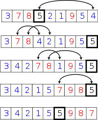

<!-- START doctoc generated TOC please keep comment here to allow auto update -->
<!-- DON'T EDIT THIS SECTION, INSTEAD RE-RUN doctoc TO UPDATE -->
**Table of Contents**  *generated with [DocToc](https://github.com/thlorenz/doctoc)*

- [算法入门-排序](#%E7%AE%97%E6%B3%95%E5%85%A5%E9%97%A8-%E6%8E%92%E5%BA%8F)
  - [冒泡排序](#%E5%86%92%E6%B3%A1%E6%8E%92%E5%BA%8F)
  - [桶排序](#%E6%A1%B6%E6%8E%92%E5%BA%8F)
  - [快速排序](#%E5%BF%AB%E9%80%9F%E6%8E%92%E5%BA%8F)
    - [非原地快排（过程中生成新的数组）](#%E9%9D%9E%E5%8E%9F%E5%9C%B0%E5%BF%AB%E6%8E%92%E8%BF%87%E7%A8%8B%E4%B8%AD%E7%94%9F%E6%88%90%E6%96%B0%E7%9A%84%E6%95%B0%E7%BB%84)
    - [原地快排（在自身数组的基础上排列）](#%E5%8E%9F%E5%9C%B0%E5%BF%AB%E6%8E%92%E5%9C%A8%E8%87%AA%E8%BA%AB%E6%95%B0%E7%BB%84%E7%9A%84%E5%9F%BA%E7%A1%80%E4%B8%8A%E6%8E%92%E5%88%97)
  - [选择排序](#%E9%80%89%E6%8B%A9%E6%8E%92%E5%BA%8F)

<!-- END doctoc generated TOC please keep comment here to allow auto update -->

## 算法入门-排序

### 冒泡排序

以从小到大的排列数组为例，依次比较相邻两个元素的大小，若前一个数字大于后一个数字，则替换两者位置。不断重复直指排列完毕

```javascript
// javascript的实现
((list) => {
  let length = list.length;
  const Sequence = (length) => {
    for(let i = 0; i < length - 1; i++) {
      if(list[i] > list[i + 1]) {
        let cache = list[i + 1];
        list[i + 1] = list[i];
        list[i] = cache;
      }
      if(i == length - 2) {
        Sequence(length - 1);
      }
    }
  }
  Sequence(length);
  console.log(list); // [0, 1, 1, 2, 3, 4, 5, 7, 11]
})([3, 5, 1, 7, 0, 11, 2, 4, 1]);
```

```python
example_list = [9, 1, 3, 0, 10, 5]

# Python的实现-1
def bubble_sort(min_index):
	for index, i in enumerate(example_list):
		if index <= len(example_list) - min_index:
			if index == len(example_list) - min_index:
				bubble_sorting(min_index + 1)
			elif i > example_list[index + 1]:
				example_list[index], example_list[index + 1] = example_list[index + 1], example_list[index]

bubble_sorting(1) # [0, 1, 3, 5, 9, 10]

# Python的实现-2
def bubble_sort():
	count = len(example_list)
	for i in range(count):
		for j in range(i + 1, count):
			if example_list[i] > example_list[j]:
				example_list[i], example_list[j] = example_list[j], example_list[i]

bubble_sort() # [0, 1, 3, 5, 9, 10]
```

### 桶排序

**仅适用于数字，且数组位数较多时耗损内存较大**

根据目标数组的最大值新建一个相等长度的新数组，以0作为其初始值。将目标数组中的数字做为key，依次填充到新建的数组中，value的大小为目标数组中该数字的数目

```javascript
// javascript的实现
((list) => {
  let length = list.length;
  let max = 0;
  // 找最大值
  list.map((value, index) => {
    if(value > max)max = value;
  });
  // 新建一个length长度的数组并以0填充。IE不兼容
  const emptyList = new Array(max + 1).fill(0);
  // 以目标数组中的数字为key，出现的次数为value，存到新建的数组中
  list.map((value, index) => {
    emptyList[value] += 1;
  });
  // 遍历新数组，依次输出大于0的value对应的index
  emptyList.map((value, index) => {
    while(value > 0) {
      console.log(index);
      value--;
    }
  });
})([3, 5, 1, 7, 0, 11, 2, 4, 1]);
```

```python
# python的实现
example_list = [9, 1, 3, 0, 10, 5, 11, 0, 1]

def barrel_sort():
	max_item = max(example_list)
	new_list = [0] * max_item
	print(new_list)
	for item in example_list:
		new_list[item - 1] += 1
	for index, item in enumerate(new_list):
		for i in range(item):
			print(index, end=' ')
		
barrel_sort()
# 0 0 2 4 8 9 10 10 10
```

### 快速排序

以从小到大排列为例：随意找一个中间数，以这个数为基准和其他数字比较大小。比它小的都排在它左边，大的排在右边。之后分别对两边的数列重复上述方法

**重点**
- 定基准——首先随机选择一个元素最为基准
- 划分区——所有比基准小的元素置于基准左侧，比基准大的元素置于右侧
- 递归调用——递归地调用此切分过程

#### 非原地快排（过程中生成新的数组）

```javascript
// javascript的实现
((list) => {
  const Sequence = (list) => {
    if(list.length <= 1)return list;
    // 取个中间值作为基准
    let middleIndex = Math.floor(list.length/2), leftList = [], rightList = [];
    let middleValue = list[middleIndex];
    list.splice(middleIndex, 1); // 不剔除中间值的话会无穷递归
    // 比中间值小的都排在左边，大的排在右边
    list.map((value, index) => {
      if(value <= middleValue) {
        leftList.push(value);
      }else {
        rightList.push(value);
      }
    });
    return Sequence(leftList).concat([middleValue], Sequence(rightList))
  }
  
  console.log(Sequence(list));
})([3, 5, 1, 7, 0, 11, 2, 4, 1]);
```

```python
# python的实现
example_list = [9, 1, 3, 0, 10, 5, 11]

def quick_sort(list):
	if len(list) <= 1:
		return list
	middle_point = list[int(len(list)/2)]
	left_list = [x for x in list if x < middle_point]
	right_list = [x for x in list if x > middle_point]
	middle_list = [x for x in list if x == middle_point]
	return quick_sort(left_list) + middle_list + quick_sort(right_list)

print(quick_sort(example_list))
# [0, 1, 3, 5, 9, 10, 11]
```

#### 原地快排（在自身数组的基础上排列）

- 单向原地快排

取最右侧的数字作为基准数（或者任取一个数字作为基准数放在数组的末尾），并以0作为基准数在其他数字遍历排列一次之后的最终storeIndex，从第一位开始，遍历基准数左侧的数字，若数字小于基准数，则将它与storeIndex的数字互换位置，且storeIndex+1



```javascript
// javascript的实现
((list) => {
  const Sequence = (startIndex, maxIndex) => {
    if(maxIndex <= startIndex)return;
    // 取最右侧数字为基准数target，输出化基准数最终的位置storeIndex
    let target = list[maxIndex], storeIndex = startIndex;
    for(let i = startIndex; i < maxIndex; i++) {
      // 把小于基准数的数字都排列到左侧，最后再移动基准数的位置
      if(list[i] <= target) {
        let temp = list[i];
        list[i] = list[storeIndex];
        list[storeIndex] = temp;
        storeIndex += 1;
      }
    }
    list[maxIndex] = list[storeIndex];
    list[storeIndex] = target;
    Sequence(startIndex, storeIndex - 1);
    Sequence(storeIndex + 1, maxIndex);
    console.log(list);
  }
  // 选取起始index
  let startIndex = 0, maxIndex = list.length - 1;
  Sequence(startIndex, maxIndex);
})([3, 5, 1, 7, 0, 11, 2, 4, 1]);
```

- 双向原地快排

```javascript
// javascript的实现
((list) => {
  let left = 1, right = list.length;
  const Sequence = (left, right) => {
    if(left > right) {
      return false;
    }
    let temp = list[left], i = left, j = right; // temp作为基准数
    while(i !== j) {
      while(list[j] <= temp && j > i)j--;
      while(list[i] >= temp && i < j)i++;
      if(i < j) {
        cache = list[i];
        list[i] = list[j];
        list[j] = cache
      }
    }
    list[left] = list[i];
    list[i] = temp; //基准数归位
    Sequence(left, i - 1);
    Sequence(i + 1, right);
    return;
  }
  Sequence(left, right);
  console.log(list);
})([3, 5, 1, 7, 0, 11, 2, 4, 1]);
```

### 选择排序

以从小到大排序为例：
核心：**找到最小元素并将它与第一位元素互换**

```javascript
((list) => {
  let maxIndex = list.length - 1;
  const Sequence = (startIndex) => {
    // 每次从第一位作为最小值开始
    let minIndex = startIndex;
    for(let i = startIndex; i < maxIndex + 1; i++) {
      if(list[i] < list[minIndex])minIndex = i; // 遇见更大值的时候记录其index
    }
    // 交换值
    let temp = list[minIndex];
    list[minIndex] = list[startIndex];
    list[startIndex] = temp;
    if(startIndex < maxIndex) {
      startIndex += 1; // 
      Sequence(startIndex);
    }
  }
  Sequence(0);
  console.log(list);
})([3, 5, 1, 7, 0, 11, 2, 4, 1]);
```