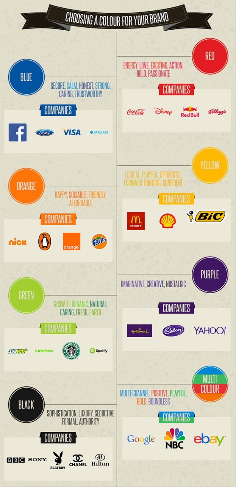
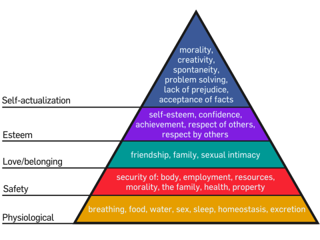

## 【译文】七条可应用于设计的心理学原则

> 本文译自：[7 Psychology Principles & Laws to Apply to Your Designs](http://justcreative.com/2016/04/13/7-psychology-principles-laws-to-apply-to-your-designs/)

> 本文由 Mike Wallagher贡献

心理学在设计中随处可见。是心理学让我们懂得红色适用于餐馆logo--它可以引起食欲--同时它也可以为首屏的按钮带来更多的转化。

身为一个设计师，决不能忽视心理学的作用。因为人类的心里会影响其行为，而这与你的设计紧密关联。接下来瞅瞅这7条可以运用在设计实践中的心理学原则吧。

### 1.冯·雷斯托夫效应（孤立效应）

冯·雷斯托夫效应告诉我们，一个元素越荒诞，它就越出众并令人记忆深刻。

这个理论由Hedwig von Restorff在1933年证实。她列举了一系列相似的物品。如果有物品被独立，例如高亮显示，那么它在整个群体中就更容易吸引注意力。

近几年来，这条理论逐渐在设计中实践。显而易见的一条是，如果你想要突出某个事物，只需要独立它，用颜色、形状、大小等其他方式凸显它。

然而，当人们集中精力于突出的事物时，就较难记起整体。请仔细斟酌是否要突出一个事物。是只让人们记住突出的重点呢，还是所有东西都很重要？如果重要性都差不多，那就不要使用高亮的标记。

### 2.色彩心理学

勤劳的设计师都会有一个自己的色彩库，并知道如何运用颜色。而设计新人往往会忽视颜色的重要性，仅仅选择他们喜欢的颜色进行设计。即便你已经掌握了很多颜色，能够熟练运用互补色、近似色，但你知道如何运用颜色打动你的用户吗？

颜色可以影响情感。Adobe在[这里](http://blogs.adobe.com/dreamweaver/2015/10/the-psychology-and-emotion-behind-color-in-web-design.html)（译者注：戳这里查看[译文](./【译文】网页设计中隐藏在色彩之后的情感和心理学.md)）列出了颜色和它们所管理的感情：

  - 黑色：老练，掌控，权利（[例子](http://www.vibe.com/)）
  - 白色：纯净，有修养，美德
  - 红色：激励，能量，力量。也可以激发食欲
  - 蓝色：平静，和平，信任，安全（[例子](https://hostingfacts.com/)）
  - 黄色：乐观，开心
  - 绿色：平衡，可持续增长
  - 紫色：浪漫，精神意识，奢侈
  - 橙黄：友善，舒适，食物
  - 粉色：平静，阴柔，性感

请牢记，色彩对人们情感的影响会根据其文化背景的改变而改变。上面的列表主要针对西方文化背景而言。

### 3.马斯洛需求层次结构

或许你在高中或大学的时候学习过马斯洛需求层次结构。下面这个图可以帮你复习一下：

这个金字塔代表了人逐步达成自我实现的各个步骤。例如，在一个人能够感到爱之前，他的生理和安全需求要得到满足。

马斯洛需求层次结构在理论之外有什么应用呢？市场人员和设计师可以将它应用于广告和公共关系中。

在设计市场推广材料的时候，就可以利用这套理论创造一个消费者的形象。细心想想你的目标用户处于金字塔的哪个阶层。你的设计该如何吸引他们进入金字塔的下一个阶层？

你还可以利用它来挑起人们的情感，将他们吸引到你的设计中去。[这些海报](http://theinspirationroom.com/daily/2006/salvation-army-invisible/)就利用了人们对爱和归属感的渴求。

