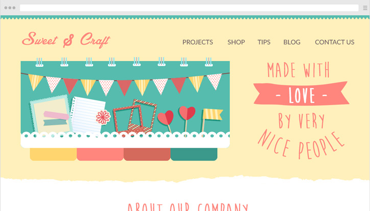
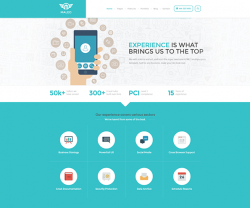
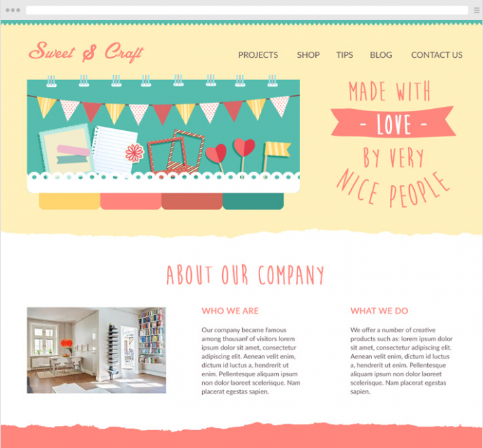

## 【译文】扁平化设计成了网页设计的标配了吗？10名设计师的心声

> 本文译自：[Is Flat Design a Web Design Standard That’s Here to Stay? 10 Designers Chip In](http://blogs.adobe.com/dreamweaver/2015/02/is-flat-design-a-web-design-standard-thats-here-to-stay-10-designers-chip-in.html)

近年来，网页设计师的设计都被要求是“有种扁平化的感觉”。换句话说，“扁平化设计”几乎等同于“好设计”了。

但扁平化设计到底只是一个短暂的趋势，还是说会成为一种长久了流行？它能成为网页设计的新标准吗？

让我们来一探究竟。

为了揭开它的神秘面纱，我请来了十位设计师共同探究这个问题：

  - 扁平化设计会成为一个标配吗？还是说迟早要为其他设计风格让位？

但首先，来回答一个基本的问题：

### 什么是扁平化设计？

抛开维基百科中让人混乱的定义，扁平化设计实际上是消去了物体三维的设计，将所有东西都拍平到一个平面上。正如它的名字--扁平化设计。

在实际应用中，这意味着阴影、斜率、光照等元素对于扁平化设计而言都是不友好的。

这里有三个Behance上的扁平化设计：

### 扁平化设计从何而来

潮流专家会告诉你，每X年都会有旧的设计转变成新的趋势。扁平化设计也是如此。它是个重获新生的老家伙。

最早的扁平化设计可以追溯到十九世纪四五十年代。当瑞士设计风格单生的时候它又卷土重来了。当我们用2015年的新目光去看待它时，它已经成为了印刷设计中的一个趋势。

（[戳我有栗子](http://www.smashingmagazine.com/2009/07/17/lessons-from-swiss-style-graphic-design/)）

这个设计重度依赖sans-serif字体，网格布局，内容-标题的良好分离，以及抽象派艺术。它与今天的扁平化设计有很多相似的地方。

### 扁平化设计为什么会在今天流行

设计每隔几年就会再度流行。但为什么扁平化设计会在现在流行？

来看看三个主要的原因：

  - 用户对于网站的认知有很多提升
  - 手机端的增加
  - 网站技术的发展

让我们一条条解析这几点，并找出未来跟随扁平化设计的正确姿势。

### 扁平化设计VS用户

目前为止，网页界面早已多样化。菜单、页面头、内容区域、网页表单、按钮、复选框、社交分享按钮、升级按钮等等。人们早已熟知这些东西并知道怎么用他们。

但是当这些东西第一次出现的时候，没人知道怎么用。网页设计在那时只是个初生的婴儿，急需某种东西将它们的工作方式传达给用户。

例如，菜单要看起来可以被点击；输入框要有一个写着“在这里输入你的名字”的标签。。没有那些东西，没人知道该如何和网站上的元素交互。

但是现在，一切都不一样了。人们懂的越多，我们在设计的时候需要给出的提示就越少。人们的常识足够帮他们分辨各个东西了。

扁平化设计也就此登上舞台。

在扁平化设计中，抽象派的风格使得可以仅仅使用少量的设计元素。而且，得益于人们认知的提升，它可以在很大程度上依赖于用户的认知。

这是一些专家的答复：

> 扁平化界面的精髓隐藏在它简单的形状和颜色之下（粗略的讲，红色代表移除，绿色代表下载）。用户已经学会了如何分辨不同的按钮和输入组件。他们不需要瞪大眼观察或者逼真的形状
> 
> 在我看来，扁平化设计并不是某个设计师一时兴起的的产物，它会像其他设计原则一样不断进化
> 
> 虽然很难确定扁平化设计会在未来被什么设计风格取代，但它确实是独特且全新的东西。

-- Sergey Shmidt, [Designmodo](http://designmodo.com/)的设计师

> 设计师们开始意识到，即便界面不是仿照真实世界，而是数字化的界面，用户也一样可以使用它们。因此，从拟物化到扁平化设计的进化变的自然而然，而且它还会以同样的方式继续进化。

-- Dan Birman, UX Designer at [Digital Telepathy](http://www.dtelepathy.com/)

### 扁平化设计vs移动设备

在扁平化设计之前最流行的设计趋势--拟物设计--在移动设备崛起之前表现的非常好。

但突然之间，移动设备变的非常强大和流行，可以像桌面端一样浏览网页，并且几乎人手一台。

现在，移动设备覆盖了各个网站。据报道，对于60%的互联网用户，移动设备是他们浏览网页的主要工具。

这对于网页设计师而言意味着一件事--他们需要对此适应并确保网页能够在不同尺寸的设备上正常浏览。

但说着容易。有好几百种手机设备，不同的屏幕，尺寸，分辨率。拟物化设计以及不能左右它们了。

这时自适应设计就诞生了。它需要将一切化繁为简，但又不时魅力。因此扁平化设计就变得人人需要了。

> 我认为扁平化设计就跟其他设计趋势一样，是从特定的需求中诞生的。
> 移动设备就像个警钟，而设计师则努力的跟上潮流，但发现在响应式设计中很难加入仿真元素。而扁平的简单的设计则对于各种尺寸的屏幕而言更好掌控。在这样的场景下，需要使用更大的输入区域、更大的按钮，更大更清晰的文本。
> 
> 扁平化设计非常符合我们的需求。但是随着科技的发展，扁平化设计也会变得不再新鲜。我们开始观望摆锤会指向哪一边。我不知道未来的设计方向在哪儿，但我对此很兴奋。

-- Preston D Lee, [Graphic Design Blender](http://www.graphicdesignblender.com/)

### 扁平化设计vs新的网页科技

最后，让我们看看网页技术的发展以及它对扁平化设计的影响。

HTML5，CSS3和JavaScript的发展宣告了拟物化设计的没落，使得扁平化设计成为可能。

而对于现代的开发者而言，他们能够更多的通过代码操纵UI而不是使用设计图。在以前只能使用例如PhotoShop这样的工具作图，而现在则可以用CSS和HTML完成一样的效果。

> 扁平化设计并不是偶然的而是正常发生的。作为网页设计师，我们依赖科技来带给我们灵感--在web1.0/2.0的时候它为我们带来的拟物化设计。而现在，CSS和JavaScript给设计带来了更多影响。我们不再需要模仿一个3D的真实世界，相反我们使用Z轴方向的动画来给数字化的设计模拟深度。

-- Cody Iddings, Sr UX Designer at Digital Telepathy

> 科技的发展允许我们用新的方式进行设计。PhotoShop的滤镜效果，hover上去的状态，复杂的帧动画统领了web领域很多年。但随着手机设备的出现，设计变得简洁了，以此确保不同设备之间的兼容性。“扁平”则是对此趋势的一个答复。

-- MK Cook, UX Designer at Digital Telepathy

### 扁平化之后又会是什么？

不管我们是否愿意，扁平化设计的思想都只是一个趋势。如同其他趋势一样，在未来它会给其他的设计让位。

但是，它的一些原则会伴随我们很久。

> 我相信扁平化设计不仅仅是一种流行。它使得我们可以更轻松的吸收信息。正因为如此，除非有新流行能够让我们更进一步的提高这方面，否则我相信扁平化设计会流行很长一段时间。
> 
> 不过，传统上每5~10年设计潮流就会有很大改变。我相信扁平化设计中的一些观念会孕育出新的趋势。

-- Payman Taei, Founder of [Visme](http://www.visme.co/)

> 我觉得至少在十年内扁平化设计不会消失，但你会发现人们越来越少提及到它；同样的，自适应设计也不会走，而是融入到了设计中。
> 
> 难以避免的是，随着新问题的产生，新的想法、新审美，新的解决方案会不断融入其中。而扁平化设计则是针对目前需求的最优解决方案。未来人们也更有可能将扁平化设计与其他设计联合使用，而不是完全废弃掉它。

-- Benjie Moss, [Webdesigner Depot](http://www.webdesignerdepot.com/)

因此，扁平化设计到底会带来什么？

额，这并不是要确切的预言什么。没人能确切的预言，但是有两个思考的方面：

  - 扁平化设计进化成新的形势
  - 彻底改变并转换方向

至少在最近几年内，扁平化设计的进化几乎必然会发生。它对于用户和网页界面交互的优化将继续提升，使得一切更加简洁且抽象，但易于理解。

这可能会导致很多网页界面看起来差不多。但总的来说，很难将它看做是缺点。

> 当我第一次看见这种设计的时候，我感到非常困惑。“为什么？怎么会需要这种东西？拟物化设计是辣么的美腻！”当当我学习并体验了一段时间之后，我转变了自己的想法并开始理解它。

-- Sergiu Radu, [eWebDesign](https://ewebdesign.com/)

但是，最可能发生的还是网页设计史上付现过很多次的事情：网页设计朝着完全不同的方向发展。

> 我认为扁平化设计终将消失并被不同流行取代。但它的核心概念仍会被我们所使用。我们之前已经见识过网页设计趋势的转变，从毛玻璃界面到逼真质地的界面，再到单色界面。每个趋势都与它之前的那个相对立。我猜想在下一次的潮流中，扁平化设计中的鲜艳色彩将会被废弃，取而代之的是单色设计。

-- Chris Spooner, [SpoonGraphics](http://blog.spoongraphics.co.uk/)

至于我，则认为扁平化设计还会再流行几年（或许2~5年）。但在那以后，设计会朝着完全不同的方向发展，就像现在扁平化成为潮流这样。