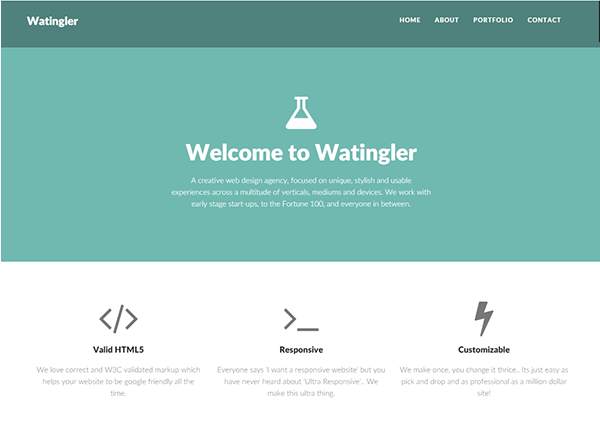

## 【译文】扁平化设计成了网页设计的标配了吗？10名设计师的心声

> 本文译自：[Is Flat Design a Web Design Standard That’s Here to Stay? 10 Designers Chip In](http://blogs.adobe.com/dreamweaver/2015/02/is-flat-design-a-web-design-standard-thats-here-to-stay-10-designers-chip-in.html)

近年来，网页设计师的设计都被要求是“有种扁平化的感觉”。换句话说，“扁平化设计”几乎等同于“好设计”了。

但扁平化设计到底只是一个短暂的趋势，还是说会成为一种长久了流行？它能成为网页设计的新标准吗？

让我们来一探究竟。

为了揭开它的神秘面纱，我请来了十位设计师共同探究这个问题：

  - 扁平化设计会成为一个标配吗？还是说迟早要为其他设计风格让位？

但首先，来回答一个基本的问题：

### 什么是扁平化设计？

抛开维基百科中让人混乱的定义，扁平化设计实际上是消去了物体三维的设计，将所有东西都拍平到一个平面上。正如它的名字--扁平化设计。

在实际应用中，这意味着阴影、斜率、光照等元素对于扁平化设计而言都是不友好的。

这里有三个Behance上的扁平化设计：

### 扁平化设计从何而来

潮流专家会告诉你，每X年都会有旧的设计转变成新的趋势。扁平化设计也是如此。它是个重获新生的老家伙。

最早的扁平化设计可以追溯到十九世纪四五十年代。当瑞士设计风格单生的时候它又卷土重来了。当我们用2015年的新目光去看待它时，它已经成为了印刷设计中的一个趋势。

（[戳我有栗子](http://www.smashingmagazine.com/2009/07/17/lessons-from-swiss-style-graphic-design/)）

这个设计重度依赖sans-serif字体，网格布局，内容-标题的良好分离，以及抽象派艺术。它与今天的扁平化设计有很多相似的地方。

### 扁平化设计为什么会在今天流行

设计每隔几年就会再度流行。但为什么扁平化设计会在现在流行？

来看看三个主要的原因：

  - 用户对于网站的认知有很多提升
  - 手机端的增加
  - 网站技术的发展

让我们一条条解析这几点，并找出未来跟随扁平化设计的正确姿势。

### 扁平化设计VS用户

目前为止，网页界面早已多样化。菜单、页面头、内容区域、网页表单、按钮、复选框、社交分享按钮、升级按钮等等。人们早已熟知这些东西并知道怎么用他们。

但是当这些东西第一次出现的时候，没人知道怎么用。网页设计在那时只是个初生的婴儿，急需某种东西将它们的工作方式传达给用户。

例如，菜单要看起来可以被点击；输入框要有一个写着“在这里输入你的名字”的标签。。没有那些东西，没人知道该如何和网站上的元素交互。

但是现在，一切都不一样了。人们懂的越多，我们在设计的时候需要给出的提示就越少。人们的常识足够帮他们分辨各个东西了。

扁平化设计也就此登上舞台。

在扁平化设计中，抽象派的风格使得可以仅仅使用少量的设计元素。而且，得益于人们认知的提升，它可以在很大程度上依赖于用户的认知。

这是一些专家的答复：

> 扁平化界面的精髓隐藏在它简单的形状和颜色之下（粗略的讲，红色代表移除，绿色代表下载）。用户已经学会了如何分辨不同的按钮和输入组件。他们不需要瞪大眼观察或者逼真的形状
> 
> 在我看来，扁平化设计并不是某个设计师一时兴起的的产物，它会像其他设计原则一样不断进化
> 
> 虽然很难确定扁平化设计会在未来被什么设计风格取代，但它确实是独特且全新的东西。

-- Sergey Shmidt, [Designmodo](http://designmodo.com/)的设计师

> 设计师们开始意识到，即便界面不是仿照真实世界，而是数字化的界面，用户也一样可以使用它们。因此，从拟物化到扁平化设计的进化变的自然而然，而且它还会以同样的方式继续进化。

-- Dan Birman, UX Designer at [Digital Telepathy](http://www.dtelepathy.com/)

