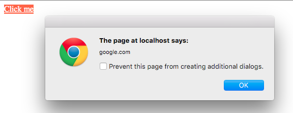
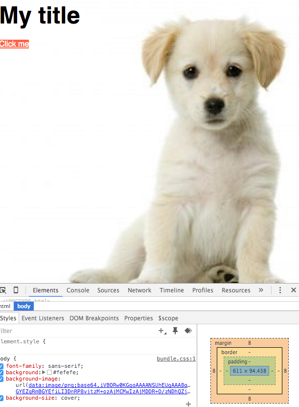
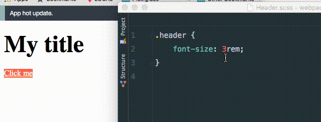
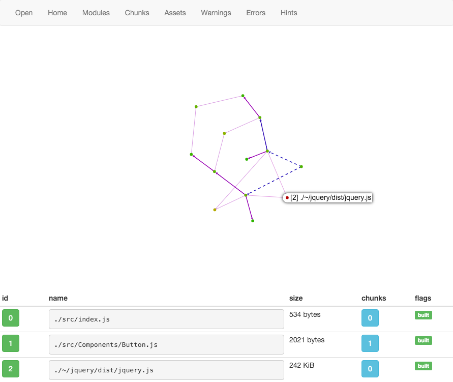
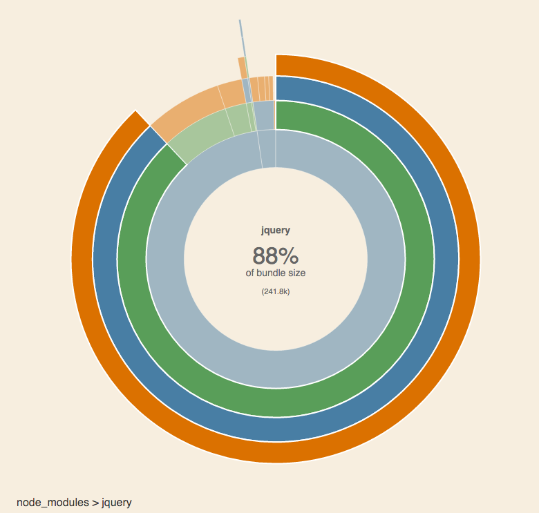

<!-- START doctoc generated TOC please keep comment here to allow auto update -->
<!-- DON'T EDIT THIS SECTION, INSTEAD RE-RUN doctoc TO UPDATE -->
**Table of Contents**  *generated with [DocToc](https://github.com/thlorenz/doctoc)*

- [【译文】用Webpack武装自己](#%E3%80%90%E8%AF%91%E6%96%87%E3%80%91%E7%94%A8webpack%E6%AD%A6%E8%A3%85%E8%87%AA%E5%B7%B1)
  - [Webpack是啥?](#webpack%E6%98%AF%E5%95%A5)
  - [究竟为什么要这么做？](#%E7%A9%B6%E7%AB%9F%E4%B8%BA%E4%BB%80%E4%B9%88%E8%A6%81%E8%BF%99%E4%B9%88%E5%81%9A%EF%BC%9F)
  - [来让我们一起构建一个简单的App](#%E6%9D%A5%E8%AE%A9%E6%88%91%E4%BB%AC%E4%B8%80%E8%B5%B7%E6%9E%84%E5%BB%BA%E4%B8%80%E4%B8%AA%E7%AE%80%E5%8D%95%E7%9A%84app)
    - [基础指引（setup）](#%E5%9F%BA%E7%A1%80%E6%8C%87%E5%BC%95%EF%BC%88setup%EF%BC%89)
    - [设置第一个loader（`loader`-01）](#%E8%AE%BE%E7%BD%AE%E7%AC%AC%E4%B8%80%E4%B8%AAloader%EF%BC%88loader-01%EF%BC%89)
    - [写个小组件（`loader`-02）](#%E5%86%99%E4%B8%AA%E5%B0%8F%E7%BB%84%E4%BB%B6%EF%BC%88loader-02%EF%BC%89)
  - [代码分离（`require.ensure`）](#%E4%BB%A3%E7%A0%81%E5%88%86%E7%A6%BB%EF%BC%88requireensure%EF%BC%89)
  - [再加个组件（`CommonChunksPlugin`）](#%E5%86%8D%E5%8A%A0%E4%B8%AA%E7%BB%84%E4%BB%B6%EF%BC%88commonchunksplugin%EF%BC%89)
  - [飞跃到生产环境（`production`）](#%E9%A3%9E%E8%B7%83%E5%88%B0%E7%94%9F%E4%BA%A7%E7%8E%AF%E5%A2%83%EF%BC%88production%EF%BC%89)
  - [抽取（`extract-text-webpack-plugin`）](#%E6%8A%BD%E5%8F%96%EF%BC%88extract-text-webpack-plugin%EF%BC%89)
  - [使用图片（`url-loader`&`file-loader`）](#%E4%BD%BF%E7%94%A8%E5%9B%BE%E7%89%87%EF%BC%88url-loader&file-loader%EF%BC%89)
  - [来个牛逼的热加载（dev-server）](#%E6%9D%A5%E4%B8%AA%E7%89%9B%E9%80%BC%E7%9A%84%E7%83%AD%E5%8A%A0%E8%BD%BD%EF%BC%88dev-server%EF%BC%89)
  - [代码不干净的人都给我去罚站！（pre-loader & lint)](#%E4%BB%A3%E7%A0%81%E4%B8%8D%E5%B9%B2%E5%87%80%E7%9A%84%E4%BA%BA%E9%83%BD%E7%BB%99%E6%88%91%E5%8E%BB%E7%BD%9A%E7%AB%99%EF%BC%81%EF%BC%88pre-loader-&-lint)
  - [还没看够？](#%E8%BF%98%E6%B2%A1%E7%9C%8B%E5%A4%9F%EF%BC%9F)
  - [就先讲到这儿吧](#%E5%B0%B1%E5%85%88%E8%AE%B2%E5%88%B0%E8%BF%99%E5%84%BF%E5%90%A7)
  - [资源](#%E8%B5%84%E6%BA%90)

<!-- END doctoc generated TOC please keep comment here to allow auto update -->

## 【译文】用Webpack武装自己

> 译自：[Webpack your bags](https://blog.madewithlove.be/post/webpack-your-bags/)


你可能已经听说过这个酷酷的工具-Webpack。一些人称之为类似于Gulp的工具，还有一些人则认为它类似于Browserify。如果你还没接触过它，那很有可能会因此感到困惑。而Webpack的主页上则认为它是两者的结合，那或许更让你困惑了。

说实话，一开始的时候，“什么是Webpack”这个话题让我很心烦，也就没有继续研究下去了。直到后来，当我已经构建了几个项目后，才真心的为之痴迷。如果你像我一样紧随Javascript的发展步伐，你很有可能会因为太追随潮流跨度太大而蛋疼。在经历了上面这些之后，我写下这篇文章，以便更加细致的解释Webpack是什么，以及它如此重要的原因。

### Webpack是啥?

首先来让我们回答最开始的问题：Webpack是个系统的构建工具，还是打包工具？答案是两者都是--这不代表它做了这两件事（先构建资源，在分别进行打包），而是说它将两者结合在一起了。

更加清晰的说明：与“构建sass文件，压缩图片，然后引用它们，再打包，再在页面上引用”相比，你只要这么做：

```javascript
import stylesheet from 'styles/my-styles.scss';
import logo from 'img/my-logo.svg';
import someTemplate from 'html/some-template.html';

console.log(stylesheet); // "body{font-size:12px}"
console.log(logo); // "data:image/svg+xml;base64,PD94bWwgdmVyc2lvbj0iMS4wIiBlbmNvZGluZz0iVVRGLTgiIHN0YW5kYWxvbmU9Im5[...]"
console.log(someTemplate) // "<html><body><h1>Hello</h1></body></html>"
```

你的所有资源都被当做包处理，可以被import，修改，控制，最终展现在你最后的一个bundle上。

为了能让上面那些有效运转，你需要在自己的Webpage配置里配置`loader`。`loader`是一个“当程序遇见XXX类型文件的时候，就做YYY”的小型插件。来看一些`loader`的例子：

```javascript
{
  // 如果引用了 .ts 文件, 将会触发 Typescript loader
  test: /\.ts/,
  loader: 'typescript',
},
{
  // 如果引用了png|jpg|svg图片,则会用 image-webpack 进行压缩 (wrapper around imagemin)
  // 并转化成 data64 URL 格式
  test: /\.(png|jpg|svg)/,
  loaders: ['url', 'image-webpack'],
},
{
  // 如果使用了 SCSS files, 则会用 node-sass 解析, 最终返回CSS格式
  test: /\.scss/,
  loaders: ['css', 'autoprefixer', 'sass'],
}
```

最终在食物链的最底端，所有的`loader`都返回`string`，这样Webpack就可以将它们加入到javascript模块中去。当你的Sass文件被loader转换之后，它的引用实际上是这样的：

```javascript
export default 'body{font-size:12px}';
```


### 究竟为什么要这么做？

在你理解了Webpack是做什么的之后，第二个问题就接踵而至：使用它有什么好处？“把图片和CSS扔进我的js里？什么鬼？”其实在很久之前，为了减少HTTP request请求，我们都被教育要把所有东西写在一个文件里面。

到了现在，与之类似的是，很多人把所有东西打包进`app.js`。这两种方法都有一个很大的负面影响：很多时候人们在下载的是他们用不到的资源。但如果你不这么做吧，你就得手动的在每个页面引用相应的资源，最终会混乱成一坨：哪个页面已经引用了它所依赖的资源？

这些方法没有绝对的对错。把Webpage当做一个中间件--不仅仅是打包或构建工具，而是个聪明的模块打包系统。只要你设置正确，它会比你还要清楚使用的技术栈，并更好的优化它们。

### 来让我们一起构建一个简单的App

为了让你更快捷的理解使用Webpack的好处，我们会构建一个简单的App，并将资源打包进去。在这里教程中我推荐使用Node4（或5），以及NPM3作为包管理工具，以便在使用Webpack的时候避免大量的麻烦。如果你还没装NPM3，可以通过`npm install npm@3 -g`来安装。

```javascript
$ node --version
v5.7.1
$ npm --version
3.6.0
```

我还要推荐你把`node_modules/.bin`放进你的`PATH`变量，以避免每次都要输入`node_modules/.bin/webpack`。在下面了例子里我输入的指令都不会再包含`node_modules/.bin`。

#### 基础指引（setup）

从创建项目安装Webpack开始。我们同时也安装了jQuery以便支持后续操作。

```javascript
$ npm init -y
$ npm install jquery --save
$ npm install webpack --save-dev
```

现在来做一个App的入口：

```javascript
// src/index.js
var $ = require('jquery');

$('body').html('Hello');
```

让我们在`webpack.config.js`文件里进行的Webpack配置。Webpack配置实质上是Javascript，并且在最后`export`出去一个Object：

```javascript
// webpack.config.js
module.exports = {
    entry:  './src',
    output: {
        path: 'builds',
        filename: 'bundle.js',
    },
};
```

在这里，`entry`告诉Webpack哪些文件是应用的入口文件。它们是你的主要文件，在依赖树的最顶端。之后，我们告诉Webpack把资源打包在`builds`文件夹下的`bundle.js`文件里。让我们编写index HTML文件。

```javascript
<!DOCTYPE html>
<html>
<body>
    <h1>My title</h1>
    <a>Click me</a>

    <script src="builds/bundle.js"></script>
</body>
</html>
```

运行Webpack。如果一切正确那就可以看见下面的信息：

```javascript
$ webpack
Hash: d41fc61f5b9d72c13744
Version: webpack 1.12.14
Time: 301ms
    Asset    Size  Chunks             Chunk Names
bundle.js  268 kB       0  [emitted]  main
   [0] ./src/index.js 53 bytes {0} [built]
    + 1 hidden modules
```

在这段信息里可以看出，`bundle.js`包含了`index.js`和一个隐藏的模块。隐藏的模块是jQuery。在默认模式下Webpack隐藏的模块都不是你写的。如果想要显示它们，我们可以在运行Webpack的时候使用`--display-modules`：

```javascript
$ webpack --display-modules
bundle.js  268 kB       0  [emitted]  main
   [0] ./src/index.js 53 bytes {0} [built]
   [1] ./~/jquery/dist/jquery.js 259 kB {0} [built]
```

你还可以使用`webpack --watch`，在改变代码的时候自动进行打包。

#### 设置第一个loader（`loader`-01）

还记得Webpack可以处理各种资源的引用吗？该怎么搞？如果你跟随了这些年Web组件发展的步伐（Angular2，Vue，React，Polymer，X-Tag等等），那么你应该知道，与一堆UI相互连接组合而成的App相比，使用可维护的小型可复用的UI组件会更好：web component。

为了确保组件能够保持独立，它们需要在自己内部打包需要的资源。想象一个按钮组件：除了HTML之外，还需要js以便和外部结合。噢对或许还需要一些样式。如果能够在需要这个按钮组件的时候，加载所有它所依赖的资源的话那就太赞了。当我们import按钮组件的时候，就获取到了所有资源。

开始编写这个按钮组件吧。首先，假设你已经习惯了ES2015语法，那么需要安装第一个loader：Babel。安装好一个loader你需要做下面这两步：首先，通过`npm install {whatever}-loader`安装你需要的loader，然后，将它加到Webpage配置的`module.loaders`里：

```javascript
$ npm install babel-loader --save-dev
```

loader并不会帮我们安装Babel所以我们要自己安装它。需要安装`babel-core`包和`es2015`预处理包。

```javascript
$ npm install babel-core babel-preset-es2015 --save-dev
```

新建`.babelrc`文件，里面是一段JSON，告诉Babel使用`es2015`进行预处理。

```javascript
// .babelrc 
{ "presets": ["es2015"] }
```

现在，Babel已经被安装并配置完成，我们要更新Webpack配置。我们想要Babel运行在所有以`.js`结尾的文件里，但是要避免运行在第三方依赖包例如jQuery里面。loader拥有`include`和`exclude`规则，里面可以是一段字符串、正则、回调等等。在这个例子里，我们只想让Babel在我们自己的文件里运行，因此使用`include`包含自己的资源文件夹：

```javascript
module.exports = {
    entry: './src',
    output: {
        path: 'builds',
        filename: 'bundle.js',
    },
    module: {
        loaders: [
            {
                test: /\.js/,
                loader: 'babel',
                include: __dirname + '/src',
            }
        ],
    }
};
```

现在，我们可以用ES6语法重写`index.js`了：

```javascript
// index.js
import $ from 'jquery';

$('body').html('Hello');
```

#### 写个小组件（`loader`-02）

来写个按钮组件吧，它将包含一些SCSS样式，HTML模板和一些操作。所以我们要安装需要的工具。首先安装Mustache这个轻量级的模板库，然后安装处理Sass和HTML的loader。同样的，为了处理Sass loader返回的结果，还要安装CSS loader。一旦获取到了CSS文件，我们就可以用很多种方式来处理。目前使用的是一个叫`style-loader`的东西，它能够把CSS插入到包中。

```javascript
$ npm install mustache --save
$ npm install css-loader style-loader html-loader sass-loader node-sass --save-dev
```

为了能够让Webpack依次处理不同loader的返回结果，我们可以将loader通过`!`链接到一起，获取使用`loaders`并对应一个由loader组成的数组：

```javascript
{
    test: /\.js/,
    loader: 'babel',
    include: __dirname + '/src',
},
{
    test: /\.scss/,
    loader: 'style!css!sass',
    // Or
    loaders: ['style', 'css', 'sass'],
},
{
    test: /\.html/,
    loader: 'html',
}
```

有了loader，我们来写写按钮：

```scss
// src/Components/Button.scss
.button {
  background: tomato;
  color: white;
}
```

```html
<!-- src/Components/Button.html -->
<a class="button" href="{{link}}">{{text}}</a>
```

```javascript
// src/Components/Button.js
import $ from 'jquery';
import template from './Button.html';
import Mustache from 'mustache';
import './Button.scss';

export default class Button {
    constructor(link) {
        this.link = link;
    }

    onClick(event) {
        event.preventDefault();
        alert(this.link);
    }

    render(node) {
        const text = $(node).text();
        // Render our button
        $(node).html(
            Mustache.render(template, {text})
        );
        // Attach our listeners
        $('.button').click(this.onClick.bind(this));
    }
}
```

你的`Button.js`现在处于完全独立的状态，不管何时何地的引用它，都能获取到所有需要的依赖并渲染出来。现在渲染我们的按钮试试：

```javascript
// src/index.js
import Button from ‘./Components/Button’;

const button = new Button(‘google.com’); 
button.render(‘a’); 
```

运行Webpack，刷新页面，立刻就能看见我们这个难看的按钮了。



现在你已经学习了如何安装loader，以及定义各个依赖配置。看起来好像也没啥。但让我们来深入扩展一下这个例子。

### 代码分离（`require.ensure`）

上面的例子还不错，但我们并不总是需要这个按钮。或许有的页面没有可以用来渲染按钮的`a`，我们并不想在这样的页面引用按钮的资源文件。这种时候代码分离就能起到作用了。代码分离是Webpack对于“整块全部打包”vs“难以维护的手动引导”这个问题而给出的解决方案。这需要在你的代码中设定“分离点”：代码可以据此分离成不同区域进行按需加载。它的语法很简单：

```javascript
import $ from 'jquery';

// 这个是分割点
require.ensure([], () => {
  // 在这里import进的代码都会被打包到一个单独的文件里
  const library = require('some-big-library');
  $('foo').click(() => library.doSomething());
});
```

在`require.ensure`中的东西都会在打包结果中分离开来--只有当需要加载它的时候Webpack才会通过AJAX请求进行加载。也就是说我们实际上得到的是这样的文件：

```javascript
bundle.js
|- jquery.js
|- index.js // 入口文件
chunk1.js
|- some-big-libray.js
|- index-chunk.js // 回调中的代码在这里
```

你不需要在任何地方引用`chunk1.js`文件，Webpack会帮你在需要的时候进行请求。这意味着你可以像我们的例子一样，根据逻辑需要引进的资源全部扔进代码里。

只有当页面上有链接存在时，再引用按钮组件：

```javascript
// src/index.js
if (document.querySelectorAll('a').length) {
    require.ensure([], () => {
        const Button = require('./Components/Button').default;
        const button = new Button('google.com');

        button.render('a');
    });
}
```

需要注意的一点是，因为`require`不会同时处理default export和normal export，所以使用`require`引用资源里default export的时候，需要手动加上`.default`。相比之下，`import`则可以进行处理：

`import foo from 'bar'` vs `import {baz} from 'bar'`

此时Webpack的output将会变得更复杂了。跑下Webpack，用`--display-chunks`打印出来看看：

```javascript
$ webpack --display-modules --display-chunks
Hash: 43b51e6cec5eb6572608
Version: webpack 1.12.14
Time: 1185ms
      Asset     Size  Chunks             Chunk Names
  bundle.js  3.82 kB       0  [emitted]  main
1.bundle.js   300 kB       1  [emitted]
chunk    {0} bundle.js (main) 235 bytes [rendered]
    [0] ./src/index.js 235 bytes {0} [built]
chunk    {1} 1.bundle.js 290 kB {0} [rendered]
    [1] ./src/Components/Button.js 1.94 kB {1} [built]
    [2] ./~/jquery/dist/jquery.js 259 kB {1} [built]
    [3] ./src/Components/Button.html 72 bytes {1} [built]
    [4] ./~/mustache/mustache.js 19.4 kB {1} [built]
    [5] ./src/Components/Button.scss 1.05 kB {1} [built]
    [6] ./~/css-loader!./~/sass-loader!./src/Components/Button.scss 212 bytes {1} [built]
    [7] ./~/css-loader/lib/css-base.js 1.51 kB {1} [built]
    [8] ./~/style-loader/addStyles.js 7.21 kB {1} [built]
```

正如你所见的那样，我们的入口`bundle.js`值包含了一些逻辑，而其他东西（jQuery，Mustache，Button）都被打包进了`1.bundle.js`，并且只在需要的时候才会被引用。现在为了能够让Webpack在AJAX的时候找到这些资源，我们需要改下配置里的`output`：

```javascript
path: 'builds',
filename: 'bundle.js',
publicPath: 'builds/',
```

`output.publicPath`告诉Webpack，从当前页面的位置出发哪里可以找到需要的资源（在这个例子里是`/builds/`）。当我们加载页面的时候一切正常，而且能够看见Webpack已经根据页面上预留的“锚”加载好了包。


如果页面上缺少“锚”(代指link)，那么只会加载`bundle.js`。通过这种方式，你可以做到在真正需要资源的时候才进行加载，避免让自己的页面变成笨重的一坨。顺带一提，我们可以改变分割点的名字，不使用`1.bundle.js`而使用更加语义化的名称。通过`require.ensure`的第三个参数来实现：

```javascript
require.ensure([], () => {
    const Button = require('./Components/Button').default;
    const button = new Button('google.com');

    button.render('a');
}, 'button');
```

这样的话就会生成`button.bundle.js`而不是`1.bundle.js`

### 再加个组件（`CommonChunksPlugin`）

来让我们再加个组件吧：

```scss
// src/Components/Header.scss
.header {
  font-size: 3rem;
}
```

```html
<!-- src/Components/Header.html -->
<header class="header">{{text}}</header>
```

```javascript
// src/Components/Header.js
import $ from 'jquery';
import Mustache from 'mustache';
import template from './Header.html';
import './Header.scss';

export default class Header {
    render(node) {
        const text = $(node).text();
        $(node).html(
            Mustache.render(template, {text})
        );
    }
}
```

将它在应用中渲染出来：

```javascript
// 如果有链接，则渲染按钮组件
if (document.querySelectorAll('a').length) {
    require.ensure([], () => {
        const Button = require('./Components/Button');
        const button = new Button('google.com');

        button.render('a');
    });
}

// 如果有标题，则渲染标题组件
if (document.querySelectorAll('h1').length) {
    require.ensure([], () => {
        const Header = require('./Components/Header');

        new Header().render('h1');
    });
}
```

瞅瞅使用了`--display-chunks --display-modules`标记后Webpack的output输出：

```js
$ webpack --display-modules --display-chunks
Hash: 178b46d1d1570ff8bceb
Version: webpack 1.12.14
Time: 1548ms
      Asset     Size  Chunks             Chunk Names
  bundle.js  4.16 kB       0  [emitted]  main
1.bundle.js   300 kB       1  [emitted]
2.bundle.js   299 kB       2  [emitted]
chunk    {0} bundle.js (main) 550 bytes [rendered]
    [0] ./src/index.js 550 bytes {0} [built]
chunk    {1} 1.bundle.js 290 kB {0} [rendered]
    [1] ./src/Components/Button.js 1.94 kB {1} [built]
    [2] ./~/jquery/dist/jquery.js 259 kB {1} {2} [built]
    [3] ./src/Components/Button.html 72 bytes {1} [built]
    [4] ./~/mustache/mustache.js 19.4 kB {1} {2} [built]
    [5] ./src/Components/Button.scss 1.05 kB {1} [built]
    [6] ./~/css-loader!./~/sass-loader!./src/Components/Button.scss 212 bytes {1} [built]
    [7] ./~/css-loader/lib/css-base.js 1.51 kB {1} {2} [built]
    [8] ./~/style-loader/addStyles.js 7.21 kB {1} {2} [built]
chunk    {2} 2.bundle.js 290 kB {0} [rendered]
    [2] ./~/jquery/dist/jquery.js 259 kB {1} {2} [built]
    [4] ./~/mustache/mustache.js 19.4 kB {1} {2} [built]
    [7] ./~/css-loader/lib/css-base.js 1.51 kB {1} {2} [built]
    [8] ./~/style-loader/addStyles.js 7.21 kB {1} {2} [built]
    [9] ./src/Components/Header.js 1.62 kB {2} [built]
   [10] ./src/Components/Header.html 64 bytes {2} [built]
   [11] ./src/Components/Header.scss 1.05 kB {2} [built]
   [12] ./~/css-loader!./~/sass-loader!./src/Components/Header.scss 192 bytes {2} [built]
```

可以看出一点问题了：这两个组件都需要jQuery和Mustache，这样的话就造成了包中的依赖重复，这可不是我们想要的。尽管Webpack会在默认情况下进行一定的优化，但还得靠插件来加足火力搞定它。

插件和loader的不同在于，loader只对一类特定的文件有效，而插件往往面向所有文件，并且并不总是会引起转化。Webpack提供了很多插件供你优化。在这里我们使用`CommonChunksPlugin`插件：它会分析你包中的重复依赖并提取出来，生成一个完全独立的文件（例如vendor.js），甚至生成你的主文件。

现在，我们想要把共同的依赖包从入口中剔除。如果所有的页面都用到了jQuery和Mustache，那么就要把它们提取出来。更新下配置吧：

```js
var webpack = require('webpack');

module.exports = {
    entry: './src',
    output: {
      // ...
    },
    plugins: [
        new webpack.optimize.CommonsChunkPlugin({
            name: 'main', // 将依赖移到我们的主文件中
            children: true, // 再在所有的子文件中检查依赖文件
            minChunks: 2, // 一个依赖重复几次会被提取出来
        }),
    ],
    module: {
      // ...
    }
};
```

再跑次Webpack，可以看出现在就好多了。其中，`main`是我们的默认依赖。

```js
chunk    {0} bundle.js (main) 287 kB [rendered]
    [0] ./src/index.js 550 bytes {0} [built]
    [2] ./~/jquery/dist/jquery.js 259 kB {0} [built]
    [4] ./~/mustache/mustache.js 19.4 kB {0} [built]
    [7] ./~/css-loader/lib/css-base.js 1.51 kB {0} [built]
    [8] ./~/style-loader/addStyles.js 7.21 kB {0} [built]
chunk    {1} 1.bundle.js 3.28 kB {0} [rendered]
    [1] ./src/Components/Button.js 1.94 kB {1} [built]
    [3] ./src/Components/Button.html 72 bytes {1} [built]
    [5] ./src/Components/Button.scss 1.05 kB {1} [built]
    [6] ./~/css-loader!./~/sass-loader!./src/Components/Button.scss 212 bytes {1} [built]
chunk    {2} 2.bundle.js 2.92 kB {0} [rendered]
    [9] ./src/Components/Header.js 1.62 kB {2} [built]
   [10] ./src/Components/Header.html 64 bytes {2} [built]
   [11] ./src/Components/Header.scss 1.05 kB {2} [built]
   [12] ./~/css-loader!./~/sass-loader!./src/Components/Header.scss 192 bytes {2} [built]
```

如果我们改变下名字`name: 'vendor'`：

```js
new webpack.optimize.CommonsChunkPlugin({
    name: 'vendor',
    children: true,
    minChunks: 2,
}),
```

Webpack会在没有该文件的情况下自动生成`builds/vendor.js`，之后我们可以手动引入：

```html
<script src="builds/vendor.js"></script>
<script src="builds/bundle.js"></script>
```

你也可以通过`async: true`，并且不提供共同依赖包的命名，来达到异步加载共同依赖的效果。

Webpack有很多这样给力的优化方案。我没法一个一个介绍它们，不过可以通过创造一个生产环境的应用来进一步学习。

### 飞跃到生产环境（`production`）

首先，要在设置中添加几个插件，但要求只有当`NODE_ENV`为`production`的时候才运行它们：

```js
var webpack = require('webpack');
var production = process.env.NODE_ENV === 'production';

var plugins = [
    new webpack.optimize.CommonsChunkPlugin({
        name: 'main',
        children: true,
        minChunks: 2,
    }),
];

if (production) {
    plugins = plugins.concat([
       // 生产环境下需要的插件
    ]);
}

module.exports = {
    entry: './src',
    output:  {
        path: 'builds',
        filename: 'bundle.js',
        publicPath: 'builds/',
    },
    plugins: plugins,
    // ...
};
```

Webpack也提供了一些可以切换生产环境的设置：

```js
module.exports = {
    debug: !production,
    devtool: production ? false : 'eval',
}
```

设置中的第一行表明在开发环境下，将开启debug模式，代码不再混做一团，利于本地调试。第二行则用来生产资源地图（sourcemaps）。Webpack有[一些方法](http://webpack.github.io/docs/configuration.html#devtool)可以生成[sourcemaps](http://www.html5rocks.com/en/tutorials/developertools/sourcemaps/)，而`eval`则是在本地表现最赞的一个。在生产环境下，我们并不关心sourcemaps，因此关闭了这个选项。

现在来添加生产环境下的插件吧：

```js
if (production) {
    plugins = plugins.concat([
        // 这个插件用来寻找相同的包和文件，并把它们合并在一起
        new webpack.optimize.DedupePlugin(),

        // 这个插件根据包/库的引用次数来优化它们
        new webpack.optimize.OccurenceOrderPlugin(),

        // 这个插件用来阻止Webpack把过小的文件打成单独的包
        new webpack.optimize.MinChunkSizePlugin({
            minChunkSize: 51200, // ~50kb
        }),

        // 压缩js文件
        new webpack.optimize.UglifyJsPlugin({
            mangle: true,
            compress: {
                warnings: false, // 禁止生成warning
            },
        }),

        // 这个插件提供了各种可用在生产环境下的变量
        // 通过设置为false，可避免生产环境下调用到它们
        new webpack.DefinePlugin({
            __SERVER__: !production,
            __DEVELOPMENT__: !production,
            __DEVTOOLS__: !production,
            'process.env': {
                BABEL_ENV: JSON.stringify(process.env.NODE_ENV),
            },
        }),

    ]);
}
```

我普遍使用的差不多就这么多了，不过Webpack还提供了非常多的插件，你可以自己去研究它们。也可以在NPM上找到很多用户自己贡献的插件。插件的链接在文末提供。

还有一个关于生产环境的优化是给资源提供版本的概念。还记得`output.filename`里的`bundle.js`吗？在这个配置里面，你可以使用一些变量，而`[hash]`则会给文件提供一段随机的字符串。除此以外，我们想要包可以被版本化，因此添加了`output.chunkFilename`：

```js
output: {
    path: 'builds',
    filename: production ? '[name]-[hash].js' : 'bundle.js',
    chunkFilename: '[name]-[chunkhash].js',
    publicPath: 'builds/',
},
```

因为无法得知每次打包生成的文件名，所以我们只在生产环境下使用它。除此之外，我们还想保证每次打包的时候，builds文件夹都会被清空以节约空间，因此使用了一个第三方插件：

```js
$ npm install clean-webpack-plugin --save-dev
```

并将它添加到配置中：

```js
var webpack = require('webpack');
var CleanPlugin = require('clean-webpack-plugin');
// ...
if (production) {
    plugins = plugins.concat([
        // 在打包前清空 builds/ 文件夹
        new CleanPlugin('builds'),
```

做完这些漂亮的优化，来比较下结果的不同吧：

```js
$ webpack
                bundle.js   314 kB       0  [emitted]  main
1-21660ec268fe9de7776c.js  4.46 kB       1  [emitted]
2-fcc95abf34773e79afda.js  4.15 kB       2  [emitted]
```

```js
$ NODE_ENV=production webpack
main-937cc23ccbf192c9edd6.js  97.2 kB       0  [emitted]  main
```

来看看Webpack都做了什么：
  - 在第一段代码中，后两个包非常轻量，异步请求不会占用多少HTTP带宽，所以在生产环境下Webpack将它们打包进了入口文件里
  - 所有东西都压缩过了。从322kb降到了97kb

> 但是这样下去，Webpack岂不是会将js文件合并成巨大的一坨吗？

是的，在这个小小的应用中是这样没错。但是你需要这么想：你不需要考虑在什么时候合并什么。如果你的包中含有太多的依赖，它们会被移走到异步请求包中而不会被合并起来。反之，如果它们很小，不值得独立加载，那么就会被合并。你只需要建立规则，Webpack会最大化的将其优化。没有人力劳作，不需要思考依赖关系，一切都是自动化的。


或许你已经注意到了，我没有对HTML或CSS进行压缩。那是因为当`debug`模式开启的时候，`css-loader`和`html-loader`已经帮我们搞好了。这也是为什么Uglify是一个独立插件的原因：在Webpack中没有`js-loader`这种东西，Webpack自己就是个JS loader。

### 抽取（`extract-text-webpack-plugin`）

可能你已经注意到了，从这个教程一开始，Webpack打包好之后，我们的样式就直接插在网页页面上，简直不能更难看了。能通过Webpack把打包过的CSS生成独立的文件吗？当然没问题：

```js
$ npm install extract-text-webpack-plugin --save-dev
```

这个插件所做的就是我刚刚说的那些：从打出的最终包里面，提取出某一类内容分离开来单独引用。它通常被用于提取CSS文件：

```js
var webpack = require('webpack');
var CleanPlugin = require('clean-webpack-plugin');
var ExtractPlugin = require('extract-text-webpack-plugin');
var production = process.env.NODE_ENV === 'production';

var plugins = [
    new ExtractPlugin('bundle.css'), // <=== 提取出来的文件
    new webpack.optimize.CommonsChunkPlugin({
        name: 'main',
        children: true, 
        minChunks: 2,
    }),
];
// ...
module.exports = {
    // ...
    plugins: plugins,
    module:  {
        loaders: [
            {
                test: /\.scss/,
                loader: ExtractPlugin.extract('style', 'css!sass'),
            },
            // ...
        ],
    }
};
```

`ExtractPlugin.extrac`方法接收两个参数，第一个参数代表当它处于已经打包好的包（'style'）里时，如何处理那些提取出来的东西；第二个参数代表当它在主文件（'css!sass'）里时，如何对待提取出的东西。当它在包里时，肯定不能直接将CSS加在生成的东西后面，所以先用`style-loader`进行处理；而对于主文件里面的styles，则将它们放进`builds/bundle.css`文件。我们来给应用加一个主样式：

```scss
// src/styles.scss
body {
  font-family: sans-serif;
  background: darken(white, 0.2);
}
```

```js
// src/index.js
import './styles.scss';

// Rest of our file
```

跑下Webpack，就能看见已经生成了`bundle.css`，可以把它引用进HTML里：

```js
$ webpack
                bundle.js    318 kB       0  [emitted]  main
1-a110b2d7814eb963b0b5.js   4.43 kB       1  [emitted]
2-03eb25b4d6b52a50eb89.js    4.1 kB       2  [emitted]
               bundle.css  59 bytes       0  [emitted]  main
```

如果你想提取出所有包里的样式，则需要设置`ExtractTextPlugin('bundle.css', {allChunks: true})`

顺带一提，你也可以自定义文件名，就跟之前说的改变js output-file名称一样：`ExtractTextPlugin('[name]-[hash].css')`

### 使用图片（`url-loader`&`file-loader`）

到目前为止，我们还没处理例如图片、字体这样的资源文件。它们在Webpack中如何工作，我们又该如何优化？接下来，我要在网站的背景里加入图片，看起来一定酷酷的：


把图片保存在`img/puppy.jpg`，更新下Sass文件：

```scss
// src/styles.scss
body {
    font-family: sans-serif;
    background: darken(white, 0.2);
    background-image: url('../img/puppy.jpg');
    background-size: cover;
}
```

如果仅仅是这样，Webpack一定会告诉你：“你特么的想让我对JPG做啥？”，那是因为还没有加入对应的loader。有两种loader可以使用：`file-loader`和`url-loader`：
  - `file-loader`：返回一段指向资源的URL，允许你给文件加入版本的概念（默认）
  - `url-loader`：以`data:image/jpeg;base64`的形式返回URL

很难说两种方法谁好谁坏：如果你的图片大于2M的话那你一定不希望它直接夹杂在代码中，而是独立出去；而如果仅仅是2kb左右的小图标。那么合并在一起减少HTTP请求会更好。因此，我们两个都要设置：

```js
$ npm install url-loader file-loader --save-dev
```

```js
{
    test: /\.(png|gif|jpe?g|svg)$/i,
    loader: 'url?limit=10000',
},
```

在这里，我们给`url-loader`了一个`limit`参数，这样，当文件大小小于10kb的时候，会采取行内样式，否则的话，会转到`file-loader`进行处理。你也可以通过`query`传递一个Object来实现它：

```js
{
    test: /\.(png|gif|jpe?g|svg)$/i,
    loader: 'url',
    query: {
      limit: 10000,
    }
}
```

来瞅一眼Webpack的输出：

```js
bundle.js   15 kB       0  [emitted]  main
1-b8256867498f4be01fd7.js  317 kB       1  [emitted]
2-e1bc215a6b91d55a09aa.js  317 kB       2  [emitted]
               bundle.css  2.9 kB       0  [emitted]  main
```

输出里面没有JPG图像，那是因为我们的小狗图片比配置里限制的大小要小，因此被加到了行内。访问页面，你就能看见这只可爱的小狗了。



这是一个非常强大的功能，它意味着Webpack可以智能的根据资源的大小和HTTP请求占有的比率，采取不同的优化方案。还有一个叫做[image-loader](https://github.com/tcoopman/image-webpack-loader)的loader，可以在打包前检查所有图片，避免图片的重复压缩。它有一个叫`?bypassOnDebug `的参数，通过它你可以只在生产环境下启动该插件。

还有很多优秀的插件，我强烈建议你使用文末的链接去查看它们。

### 来个牛逼的热加载（dev-server）

我们的生产环境以及整的差不多了，现在应该更多的关心一下本地开发。或许你以及注意到了，当人们提及开发工具的时候，总是会提及热加载：LiveReload，BrowserSync，或者其他的什么鬼东西。但是只有傻瓜才会整页的刷新，我们则使用更高端的热加载。因为Webpack可以确切的知道你依赖树中某一点位置的代码，因此每次的改变都会据此生成一个新的文件。简单的说，就是不需要刷新页面就能将改变展现在屏幕上。

为了能够使用HMR，我们需要一个server来启动热加载。Webpack提供的`dev-server`可以完成这个任务：

```js
$ npm install webpack-dev-server --save-dev
```

安装下面的命令启动server，不能再简单了：

```js
$ webpack-dev-server --inline --hot
```

第一个标记`--inline`是让Webpack把HMR逻辑直接写入页面上而不是放到iframe里，而第二个标记则开启了HMR。接下来，访问`http://localhost:8080/webpack-dev-server/`,嗯还是那个正常的页面。试着修改Sass文件，MAGIC！



你可以把webpack-dev-server作为自己本地的server。如果你打算一直使用HMR，就需要这么配置：

```js
output: {
    path: 'builds',
    filename: production ? '[name]-[hash].js' : 'bundle.js',
    chunkFilename: '[name]-[chunkhash].js',
    publicPath: 'builds/',
},
devServer: {
    hot: true,
},
```

这样的话，不管我们什么时候运行`webpack-dev-server`，都会是HMR模式。值得一提的是，我们在这里使用`webpack-dev-server`对资源进行热加载，但也可以使用在其他地方例如Express server上。Webpack提供了一个中间件，使得你可以把HMR的功能用在其他server上。

### 代码不干净的人都给我去罚站！（pre-loader & lint)

如果你一直跟着本教程走，那或许会有这样的疑问：为什么loader都在`module.loaders`中而插件不在？那当然是因为还有其他可以配置进`module`的东西~Webpack不只是有loader，也有pre-loader和post-loader：在main-loader运行之前和之后发动的玩意。举个栗子：我基本可以确信自己在这个文章里面写的代码很糟糕，所以使用ESLint进行代码检查：

```js
$ npm install eslint eslint-loader babel-eslint --save-dev
```

新建一个肯定会引发错误的`.eslintrc`文件：

```js
// .eslintrc
parser: 'babel-eslint'
rules:
  quotes: 2
```

现在增加pre-loader，语法和之前的一样，只不过加在`module.preLoaders`里：

```js
module:  {
    preLoaders: [
        {
            test: /\.js/,
            loader: 'eslint',
        }
    ],
```

启动Webpack，然后淡定的看它失败：

```js
$ webpack
Hash: 33cc307122f0a9608812
Version: webpack 1.12.2
Time: 1307ms
                    Asset      Size  Chunks             Chunk Names
                bundle.js    305 kB       0  [emitted]  main
1-551ae2634fda70fd8502.js    4.5 kB       1  [emitted]
2-999713ac2cd9c7cf079b.js   4.17 kB       2  [emitted]
               bundle.css  59 bytes       0  [emitted]  main
    + 15 hidden modules

ERROR in ./src/index.js

/Users/anahkiasen/Sites/webpack/src/index.js
   1:8   error  Strings must use doublequote  quotes
   4:31  error  Strings must use doublequote  quotes
   6:32  error  Strings must use doublequote  quotes
   7:35  error  Strings must use doublequote  quotes
   9:23  error  Strings must use doublequote  quotes
  14:31  error  Strings must use doublequote  quotes
  16:32  error  Strings must use doublequote  quotes
  18:29  error  Strings must use doublequote  quotes
```

再举个pre-loader的例子：每个组件里我们都引用了stylesheet，而它们都有相同命名的对应模板。使用一个pre-loader可以自动将有相同名称的文件作为一个module载入：

```js
$ npm install baggage-loader --save-dev
```

```js
{
    test: /\.js/,
    loader: 'baggage?[file].html=template&[file].scss',
}
```

通过这样的方式告知Webpack，如果遇见和配置相同的HTML文件，则将它作为`template `引入，同时引入和它同名的Sass文件。这样就能改写组件文件：

将：

```js
import $ from 'jquery';
import template from './Button.html';
import Mustache from 'mustache';
import './Button.scss';
```

改为：

```js
import $ from 'jquery';
import Mustache from 'mustache';
```

你看，pre-loaders也可以很强大。在文末你可以找到更多的loader

### 还没看够？

现在我们的应用还很小，当它变的庞大的时候，观测依赖树就变的非常有用了，从中可以看出我们做的是对是错，应用的瓶颈在哪里等等。Webpack知晓这一切，不过我们得礼貌的请教它才能知晓答案。为了做到这点，你可以通过下面的命令运行Webpack：

```js
webpack --profile --json > stats.json
```

第一个标记会让Webpack生成一个profile文件，而第二个则将它转化为JSON格式。最终，讲所有的output都生成了JSON文件。现在有很多网站都可以解析这个JSON文件，不过Webpack官方提供了一个解码的网站[Webpack Analyze](http://webpack.github.io/analyse/)。将JSON文件导入，进入Modules板块，就可以看见自己依赖树的可视化图像：



小圆点越红，则证明在打包的时候越困难。在这个例子中，jQuery作为最大的文件而成为罪魁祸首。再瞅瞅网站上的其他模块。或许你无法从这个小小的例子里学到很多东西，但是这个工具在分析依赖树和包的时候真的非常有用。

我之前提过，现在有很多服务提供可以对profile文件进行分析。其中一个是[Webpack Visualizer](http://chrisbateman.github.io/webpack-visualizer/)，它可以以饼状图的形式告知你各个文件占据了多大的比重：



### 就先讲到这儿吧

对我而言，Webpack已经取代了Grunt或者Gulp：大部分的功能可以使用Webpack替代，其他的则使用NPM脚本就够了。在以前，每个任务中我们都要通过Aglio，把API文档转换为HTML，而现在只需要这么做：

```js
// package.json
{
  "scripts": {
    "build": "webpack",
    "build:api": "aglio -i docs/api/index.apib -o docs/api/index.html"
  }
}
```

即便是一些不需要打包和构建的Glup任务，Webpack都贴心的提供了对应的服务。下面是一个将Glup融合进Webpack的例子：

```js
var gulp = require('gulp');
var gutil = require('gutil');
var webpack = require('webpack');
var config = require('./webpack.config');

gulp.task('default', function(callback) {
  webpack(config, function(error, stats) {
    if (error) throw new gutil.PluginError('webpack', error);
    gutil.log('[webpack]', stats.toString());

    callback();
  });
});
```

因为Webpack具有Node API，因此可以很轻松了运用在其他构建体系中。不用多久你就能发现自己深爱着它无法自拔了。

不管怎样，这篇文字带你预览了Webpack能够帮你做的事情。或许你认为我们讲了很多方面，但实际上这只是个表皮而已：multiple entry points, prefetching, context replacement等等都还没有涉及到。Webpack是个强大的工具，也因此比那些传统的工具更加难懂。但一旦你知道如何使用它，它就会为你鸣奏最悦耳动听的声音。我曾在一些项目里使用过它，它提供的强大的优化和自动化让我深深不能自拔。

### 资源

  - [Webpack documentation](https://webpack.github.io/)
  - [List of loaders](http://webpack.github.io/docs/list-of-loaders.html)
  - [List of plugins](http://webpack.github.io/docs/list-of-plugins.html)
  - [Sources for this article](https://github.com/madewithlove/webpack-article/commits/master)
  - [Our Webpack configuration package](https://github.com/madewithlove/webpack-config)